# matplot

## 基础


```python
import matplotlib.pyplot as plt
import numpy as np

x = np.linspace(-1,1,50)
y = 2*x +1 
y = x**2
plt.plot(x,y)
plt.show()
```


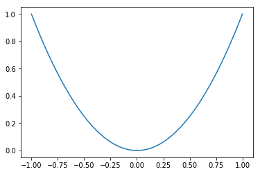


## figure使用

figure： 显示图片的窗口


```python
import matplotlib.pyplot as plt
import numpy as np

x = np.linspace(-3,3,50)
y1 = 2*x +1 
y2 = x**2
plt.figure()
plt.plot(x,y1)
plt.plot(x,y2)
plt.show()
#num 编号 size（长，宽），figure下所有内容在一张图片

plt.figure(num=3,figsize=(8,5))
plt.plot(x,y1)
'''
color 颜色
linewidth 线宽
linestyle 线样式

'''
plt.plot(x,y2,color='red',linewidth=10.0,linestyle='--')
plt.show()
```


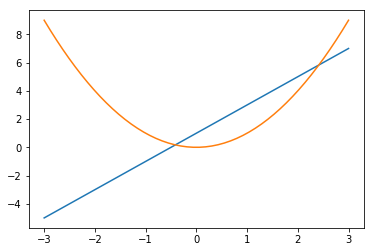


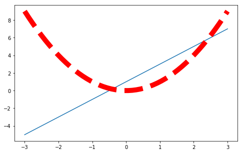


## 设置坐标轴


```python
import matplotlib.pyplot as plt
import numpy as np

x = np.linspace(-3,3,50)
y1 = 2*x +1 
y2 = x**2

plt.figure(num=3,figsize=(8,5))
plt.plot(x,y1)
'''
color 颜色
linewidth 线宽
linestyle 线样式

'''
plt.plot(x,y2,color='red',linewidth=1.0,linestyle='--')
#设置坐标范围
plt.xlim((-1,3))
plt.ylim((-2,5))
## 设置坐标轴label
plt.xlabel('i am x ')
plt.ylabel('i am y ')
new_ticks = np.linspace(-1,2,5)
print(new_ticks)
plt.xticks(new_ticks)
## 文字修改
plt.yticks(new_ticks,['a','b','c','d','e'])

## gca = 'get current axis' 获取需要修改的坐标轴
ax = plt.gca()
## 边框设置颜色
ax.spines['right'].set_color('none')
ax.spines['top'].set_color('none')
##  选取x,y轴
ax.xaxis.set_ticks_position('bottom')
ax.yaxis.set_ticks_position('left')
## 指定x，y轴的位置
ax.spines['bottom'].set_position(('data',0)) ##axes：定位到百分之多少位置；data按照数据定义
ax.spines['left'].set_position(('data',0))
plt.show()
```

    [-1.   -0.25  0.5   1.25  2.  ]
    


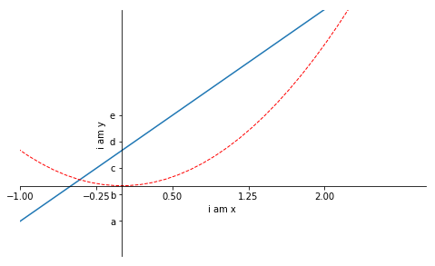


## 图例设置


```python
import matplotlib.pyplot as plt
import numpy as np

x = np.linspace(-3,3,50)
y1 = 2*x +1 
y2 = x**2

plt.figure(num=3,figsize=(8,5))

#设置坐标范围
plt.xlim((-1,3))
plt.ylim((-2,5))
## 设置坐标轴label
plt.xlabel('i am x ')
plt.ylabel('i am y ')
new_ticks = np.linspace(-1,2,5)
plt.xticks(new_ticks)
## 文字修改
plt.yticks(new_ticks,['a','b','c','d','e']) 
# label 为曲线取名,加，传入legend
l1,=plt.plot(x,y1,label='up')
l2,=plt.plot(x,y2,color='red',linewidth=1.0,linestyle='--',label='down')
# 显示图例名称
plt.legend(handles=[l1,l2,],labels=['a','b'],loc='lower right')
plt.show()
```


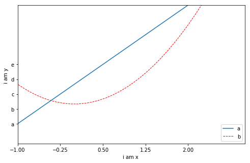


## 注释


```python
import matplotlib.pyplot as plt
import numpy as np

x = np.linspace(-3,3,50)
y1 = 2*x +1 
y2 = x**2

plt.figure(num=3,figsize=(8,5))
plt.plot(x,y1)
plt.plot(x,y2)
#plt.plot(x,y2,color='red',linewidth=1.0,linestyle='--')

## gca = 'get current axis' 获取需要修改的坐标轴
ax = plt.gca()
## 边框设置颜色
ax.spines['right'].set_color('none')
ax.spines['top'].set_color('none')
##  选取x,y轴
ax.xaxis.set_ticks_position('bottom')
ax.yaxis.set_ticks_position('left')
## 指定边框轴的位置
ax.spines['bottom'].set_position(('data',0)) ##axes：定位到百分之多少位置；data按照数据定义
ax.spines['left'].set_position(('data',0))

##
x0 = 1 
y0 = 2*x0+1
## 打印点
plt.scatter(x0,y0,s=50,color='r')
#打印虚线
#'k--':颜色线形 ； lw：line wideth
plt.plot([x0,x0],[y0,0],'k--',lw=2.5)
## 注释添加方法1 
'''
文本
xy基于什么
指定曲线
指定标记点
指定文本打印位置
test基于什么
字体大小
箭头样式（箭头样式，弧度）

'''
plt.annotate(r'$2x+1=%s$'%y0,xy=(x0,y0),xycoords='data',
             xytext=(+30,-30),textcoords='offset points',
             fontsize=16,arrowprops=dict(arrowstyle='->',connectionstyle='arc3,rad=.2'))

plt.text(-3.7,3,r'$this\ is\ test$',fontdict={'size':16,'color':'r'})
plt.show()

```


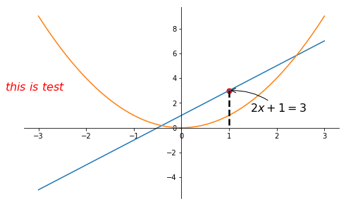


## 设置坐标轴颜色


```python
import matplotlib.pyplot as plt
import numpy as np

x = np.linspace(-3,3,50)
y1 = 2*x +1 
y2 = x**2

plt.figure(num=3,figsize=(8,5))
plt.plot(x,y1,'r--')
plt.plot(x,y2)
#plt.plot(x,y2,color='red',linewidth=1.0,linestyle='--')

## gca = 'get current axis' 获取需要修改的坐标轴
ax = plt.gca()
## 边框设置颜色
ax.spines['right'].set_color('none')
ax.spines['top'].set_color('none')
##  选取x,y轴
ax.xaxis.set_ticks_position('bottom')
ax.yaxis.set_ticks_position('left')
## 指定边框轴的位置
ax.spines['bottom'].set_position(('data',0)) ##axes：定位到百分之多少位置；data按照数据定义
ax.spines['left'].set_position(('data',0))
for label in ax.get_xticklabels() + ax.get_yticklabels():
    label.set_fontsize(12)
    #alpha 透明度
    label.set_bbox(dict(facecolor='b',edgecolor='None',alpha=0.7))
    

plt.show()
```


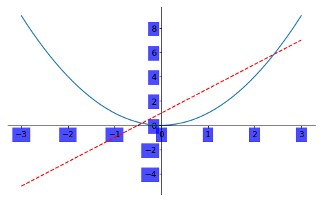


## scatter 散点图


```python
import numpy as np

import matplotlib.pyplot as plt

n = 1024

X = np.random.normal(0,1,n)
print(X)
Y = np.random.normal(0,1,n)
print(Y)
T = np.arctan2(Y,X)
#x,y,color,透明度
plt.scatter(X,Y,s=75,c=T,alpha=0.5)
plt.xlim(-1.5,1.5)
plt.ylim(-1.5,1.5)
plt.xticks(())
plt.yticks(())
plt.show()

```

    [ 0.42574442  0.06481014 -0.42701708 ... -0.32344855  0.80856861
      0.86975504]
    [-0.45119819  0.15276917 -0.0189683  ...  0.40722978  0.63967034
     -1.57724659]
    


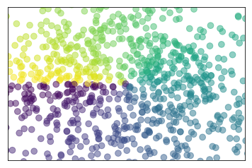


## bar柱状图


```python
import matplotlib.pyplot as plt
import numpy as np

n = 12 
X = np.arange(n)
Y1 = (1-X / float(n))*np.random.uniform(0.5,1.0,n)
Y2 = (1-X / float(n))*np.random.uniform(0.5,1.0,n)
#x,(方向)y，图像颜色，边框颜色
plt.bar(X,+Y1,facecolor='#9999ff',edgecolor='white')
plt.bar(X,-Y1)
for x,y in zip(X,Y1):
    #位置x，位置y，显示值
    plt.text(x,y,'%.2f'%y,ha='center',va='bottom')
for x,y in zip(X,Y1):
    #位置x，位置y，显示值
    plt.text(x,-y,'-%.2f'%y,ha='center',va='bottom')
plt.show()
```


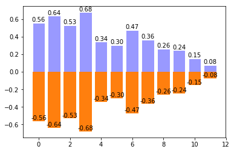


## contours等高线


```python
import matplotlib.pyplot as plt
import numpy as np

def f(x,y):
    return (1-x/2+x**5+y**3)*np.exp(-x**2-y**2)

n = 256
x = np.linspace(-3,3,n)
y = np.linspace(-3,3,n)

X,Y = np.meshgrid(x,y)
#画图
#x,y,高度，等高线分几份,透明度，值对应的颜色
plt.contourf(X,Y,f(X,Y),8,alpha=0.75,cmap=plt.cm.hot)
## 设置等高线
C = plt.contour(X,Y,f(X,Y),8,colors='black',linewidth=0.5)
## add label
##目标等高线，是否在线上，字体
plt.clabel(C,inline=True,fontsize=10)

plt.show()
```

    d:\python35\lib\site-packages\matplotlib\contour.py:960: UserWarning: The following kwargs were not used by contour: 'linewidth'
      s)
    


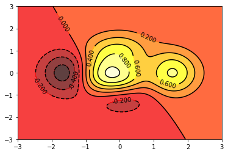


## 打印图像


```python
import matplotlib.pyplot as plt
import numpy as np

a = np.array([0.31,0.36,0.42,0.365,0.439,0.525,0.4237,0.5250,0.6515]).reshape(3,3)
##图片矩阵，方格形式，颜色，色深顺序
plt.imshow(a,interpolation='nearest',cmap='bone',origin='upper')
#尺寸
plt.colorbar(shrink=0.9)
plt.show()
```


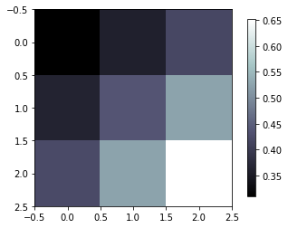


## 3D图像支持


```python
import numpy as np
import matplotlib.pyplot as plt
from mpl_toolkits.mplot3d import Axes3D

##添加底图
fig = plt.figure()
##建立3d底图
ax = Axes3D(fig)

X = np.arange(-4,4,0.25)
Y = np.arange(-4,4,0.25)
#网格点坐标矩阵
X,Y = np.meshgrid(X,Y)
R = np.sqrt(X**2+Y**2)
Z = np.sin(R)
#x,y,z,行跨度，列跨，颜色
ax.plot_surface(X,Y,Z,rstride=1,cstride=1,cmap=plt.get_cmap('rainbow'))
## x,y,z ,投影方向,投影位置
ax.contourf(X,Y,Z,zdir='y',offset=-2,cmap='rainbow')
ax.set_zlim(-2,2)
plt.show()
```


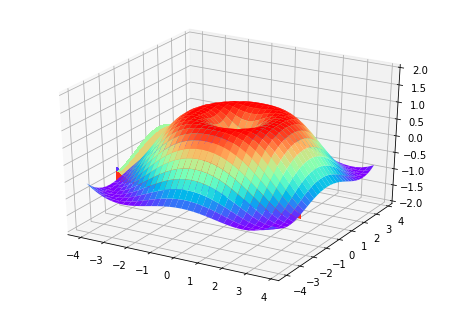


## 多图合并显示

### subplot


```python
import matplotlib.pyplot as plt
plt.figure()
#行，列，编号
plt.subplot(2,1,1)
plt.plot([0,1],[0,1])
plt.title('hhh')
plt.subplot(2,3,4)
plt.plot([0,1],[0,1])

plt.subplot(2,3,5)
plt.plot([0,1],[0,1])

plt.subplot(2,3,6)
plt.plot([0,1],[0,1])

plt.show()
```


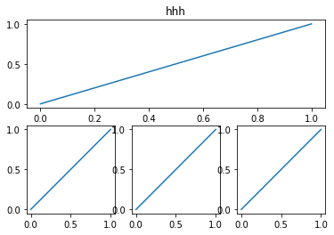


###   gridspec


```python
import matplotlib.pyplot as plt
import matplotlib.gridspec as gridspec
plt.figure()
##行列；起始点；跨度
ax1 = plt.subplot2grid((3,3),(0,0),colspan=3,rowspan=1)
ax1.plot([1,2],[1,2])
ax1.set_title('1')
ax2 = plt.subplot2grid((3,3),(1,0),colspan=2,rowspan=1)
ax2.set_title('2')
ax3 = plt.subplot2grid((3,3),(1,2),colspan=1,rowspan=2)
ax4 = plt.subplot2grid((3,3),(2,0),colspan=1,rowspan=1)
ax5 = plt.subplot2grid((3,3),(2,1),colspan=1,rowspan=1)
plt.show()
```


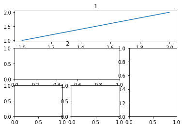


```python
import matplotlib.pyplot as plt
import matplotlib.gridspec as gridspec

plt.figure()
gs = gridspec.GridSpec(3,3)
ax1 = plt.subplot(gs[0,:])
ax1.set_title('aaaaa')

ax2 = plt.subplot(gs[1,:2])
ax3 = plt.subplot(gs[1:,2])
ax4 = plt.subplot(gs[-1,0])
ax5 = plt.subplot(gs[-1,-2])
                  
plt.tight_layout()
plt.show()
```


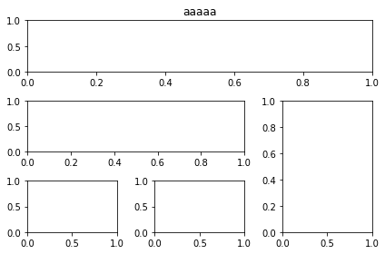


## 图中图


```python
import matplotlib.pyplot as plt


fig = plt.figure()
x = [1,2,3,4,5,6,7]
y = [1,3,4,2,5,8,6]
left,bottom,width,height = 0.1,0.1,0.8,0.8
ax1 = fig.add_axes([left,bottom,width,height])
ax1.plot(x,y,'r')
ax1.set_xlabel('x')
ax1.set_ylabel('y')
ax1.set_title('title')

left,bottom,width,height = 0.2,0.6,0.25,0.25
ax2 = fig.add_axes([left,bottom,width,height])
ax2.plot(x,y,'b')
ax2.set_xlabel('x')
ax2.set_ylabel('y')
ax2.set_title('inside1')

plt.show()
```


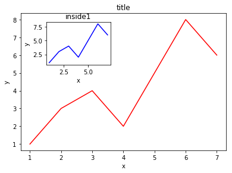


## 次坐标轴


```python
import matplotlib.pyplot as plt
import numpy as np

x = np.arange(0,10,0.1)
y1 = 0.05*x**2
y2 = -1*y1+5

fig,ax1 = plt.subplots()
#镜面，ax1镜面
ax2 = ax1.twinx()
ax1.plot(x,y1,'g-')
ax1.plot(x,y2,'r-.')

ax1.set_xlabel('X data')
ax1.set_ylabel('Y1',color='g')
ax2.set_ylabel('Y2',color='b')

plt.show()
```


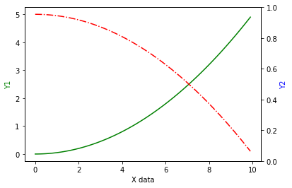


## 动画


```python
import numpy as np
from matplotlib import pyplot as plt 
from matplotlib import animation

fig,ax = plt.subplots()

x = np.arange(0,2*np.pi,0.01)

line, = ax.plot(x,np.sin(x))
def animate(i):
    line.set_ydata(np.sin(x+i/100))
    return line,

def init():
    line.set_ydata(np.sin(x))
    return line,
#图像，，帧数，初始样子，刷新时间间隔，否是更新未变化点
ani = animation.FuncAnimation(fig=fig,func=animate,frames=100,init_func=init,interval=20,blit=False)

plt.show()
```


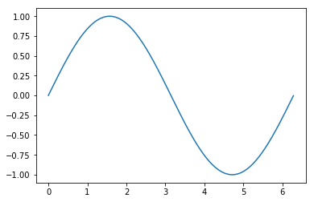

