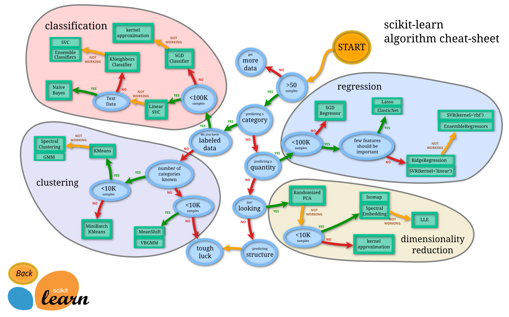
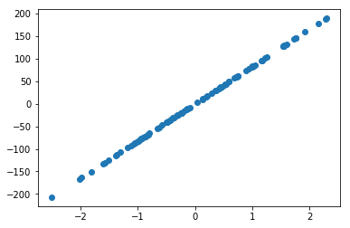
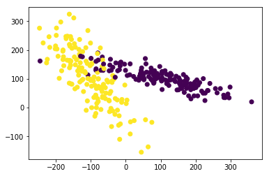
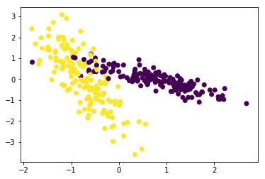
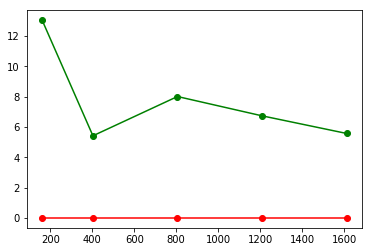
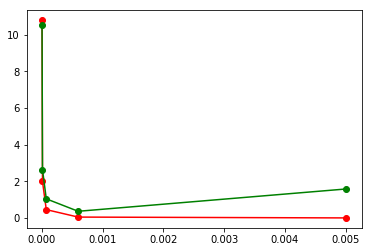

# sklearn



## knn


```python
import numpy as np
# load datas
from sklearn import datasets
# training data get 
from sklearn.cross_validation import train_test_split
from sklearn.neighbors import KNeighborsClassifier
# 加载数据
iris = datasets.load_iris()
iris_X = iris.data
iris_y = iris.target

```


```python
print(iris_X[:2,:])
print(iris_y)
```

    [[5.1 3.5 1.4 0.2]
     [4.9 3.  1.4 0.2]]
    [0 0 0 0 0 0 0 0 0 0 0 0 0 0 0 0 0 0 0 0 0 0 0 0 0 0 0 0 0 0 0 0 0 0 0 0 0
     0 0 0 0 0 0 0 0 0 0 0 0 0 1 1 1 1 1 1 1 1 1 1 1 1 1 1 1 1 1 1 1 1 1 1 1 1
     1 1 1 1 1 1 1 1 1 1 1 1 1 1 1 1 1 1 1 1 1 1 1 1 1 1 2 2 2 2 2 2 2 2 2 2 2
     2 2 2 2 2 2 2 2 2 2 2 2 2 2 2 2 2 2 2 2 2 2 2 2 2 2 2 2 2 2 2 2 2 2 2 2 2
     2 2]
    


```python
# 获取训练集

X_train, X_test, y_train, y_test = train_test_split(iris_X,iris_y, test_size=0.3)

print(len(y_test))
print(len(y_train))
print(len(iris_y))
```

    45
    105
    150
    


```python
knn = KNeighborsClassifier()
#训练
knn.fit(X_train,y_train)
```


    KNeighborsClassifier(algorithm='auto', leaf_size=30, metric='minkowski',
               metric_params=None, n_jobs=1, n_neighbors=5, p=2,
               weights='uniform')


```python
print(knn.predict(X_test))
print(y_test)
```

    [2 1 0 0 1 2 2 0 2 0 2 0 0 1 0 2 2 0 1 2 2 2 2 1 0 0 1 1 1 0 0 1 2 1 0 2 1
     2 1 0 2 0 0 0 2]
    [2 1 0 0 1 2 2 0 2 0 2 0 0 1 0 2 2 0 1 2 2 2 2 1 0 0 1 1 1 0 0 1 2 1 0 2 1
     1 1 0 1 0 0 0 2]
    

## dataset 数据库


```python
from sklearn import datasets 
from sklearn.linear_model import LinearRegression
import matplotlib.pyplot as plt
load_data = datasets.load_boston()
data_X = load_data.data
data_y = load_data.target 

#print(data_X[:2,:])

model = LinearRegression()

model.fit(data_X,data_y)


print(model.predict(data_X[:4,:]))
print(data_y[:4])
#打印参数
print(model.coef_)
#打印常数项
print(model.intercept_)
#模型配置（是否覆盖原始数据，标准化，是否存在常数项，运算核数）
print(model.get_params())
#评估模型效果,coefficient of determination ,R^2
print(model.score(data_X,data_y))
```

    [30.00821269 25.0298606  30.5702317  28.60814055]
    [24.  21.6 34.7 33.4]
    [-1.07170557e-01  4.63952195e-02  2.08602395e-02  2.68856140e+00
     -1.77957587e+01  3.80475246e+00  7.51061703e-04 -1.47575880e+00
      3.05655038e-01 -1.23293463e-02 -9.53463555e-01  9.39251272e-03
     -5.25466633e-01]
    36.49110328036133
    {'copy_X': True, 'normalize': False, 'fit_intercept': True, 'n_jobs': 1}
    0.7406077428649427
    

## 新建数据集


```python
X,y = datasets.make_regression(n_samples=100,n_features=1,n_targets=1,noise=1)
plt.scatter(X,y)
```


    <matplotlib.collections.PathCollection at 0x28b9f1cdf28>





## 标准化


```python
from sklearn import preprocessing
import numpy as np
import  matplotlib.pyplot as plt
from sklearn.cross_validation import train_test_split
from sklearn.datasets.samples_generator import make_classification
from sklearn.svm import SVC


a = np.array([[10,2.7,3.6],[-100,5,-2],[120,20,40]],dtype=np.float64)
print(a)
#标准化，归一化
print(preprocessing.scale(a))    
```

    [[  10.     2.7    3.6]
     [-100.     5.    -2. ]
     [ 120.    20.    40. ]]
    [[ 0.         -0.85170713 -0.55138018]
     [-1.22474487 -0.55187146 -0.852133  ]
     [ 1.22474487  1.40357859  1.40351318]]
    


```python
'''
n_features :特征个数= n_informative（） + n_redundant + n_repeated
n_informative：多信息特征的个数
n_redundant：冗余信息，informative特征的随机线性组合
n_repeated ：重复信息，随机提取n_informative和n_redundant 特征
n_classes：分类类别
n_clusters_per_class ：某一个类别是由几个cluster构成的
weights:列表类型，权重比
class_sep:乘以超立方体大小的因子。 较大的值分散了簇/类，并使分类任务更容易。默认为1
random_state: 如果是int，random_state是随机数发生器使用的种子; 如果RandomState实例，random_state是随机数生成器;
如果没有，则随机数生成器是np.random使用的RandomState实例。
'''
X,y = make_classification(n_samples=300,n_classes=2, n_features=2, n_redundant=0, n_informative=2,random_state=22,n_clusters_per_class=1,scale=100)
#print(y)
plt.figure()
plt.scatter(X[:,0],X[:,1],c=y)
## 指定压缩
#X = preprocessing.minmax_scale(X,feature_range=(-1,1))
X = preprocessing.scale(X)

plt.figure()
plt.scatter(X[:,0],X[:,1],c=y)
X = preprocessing.scale(X)
X_train,X_test,y_train,y_test = train_test_split(X, y, test_size=0.3 )

clf = SVC()
clf.fit(X_train,y_train)
print(clf.score(X_test,y_test))
```

    0.9
    








## 交叉验证


```python
from sklearn.datasets import load_iris
from sklearn.cross_validation import train_test_split
from sklearn.neighbors import KNeighborsClassifier
from sklearn.cross_validation import cross_val_score
iris = load_iris()
X = iris.data
y = iris.target

X_train, X_test, y_train, y_test = train_test_split(X, y, random_state=4)#random_state 保证随机拉取的结果一样
knn = KNeighborsClassifier(n_neighbors=5)#5个neighbour
knn.fit(X_train,y_train)
print(knn.score(X_test,y_test))

scores = cross_val_score(knn,X,y,cv=5,scoring='accuracy')#模型；x,ycv分几份；误差方法判断
print(scores)
print(scores.mean())

```

    0.9736842105263158
    [0.96666667 1.         0.93333333 0.96666667 1.        ]
    0.9733333333333334
    

## over fitting


```python
from sklearn.learning_curve import learning_curve
from sklearn.datasets import load_digits
from sklearn.svm import SVC
import matplotlib.pyplot as plt 
import numpy as np 

digits = load_digits()
X = digits.data
y = digits.target
#模型，x,y，份数，损失函数，打印位置
train_sizes,train_loss,test_loss = learning_curve(SVC(gamma=0.01),X,y,cv=10,scoring='mean_squared_error',train_sizes=[0.1,0.25,0.5,0.75,1])
train_loss_mean = -np.mean(train_loss, axis=1)
test_loss_mean = -np.mean(test_loss,axis=1)
print(train_sizes)
plt.figure()
plt.plot(train_sizes,train_loss_mean,'ro-',label='Training')
plt.plot(train_sizes,test_loss_mean,'go-',label='cross')
```

    [ 161  403  806 1209 1612]
    


    [<matplotlib.lines.Line2D at 0x28ba19c14e0>]





##  交叉验证--超参数


```python
from sklearn.learning_curve import validation_curve
from sklearn.datasets import load_digits
from sklearn.svm import SVC
import matplotlib.pyplot as plt 
import numpy as np 

digits = load_digits()
X = digits.data
y = digits.target
#参数变动范围 log6
param_range = np.logspace(-6,-2.3,5)
#模型，x,y，需要改变的参数，参数取值范围，份数，损失函数，打印位置
train_loss,test_loss = validation_curve(SVC(),X,y,param_name='gamma',param_range=param_range,cv=10,scoring='mean_squared_error')
train_loss_mean = -np.mean(train_loss, axis=1)
test_loss_mean = -np.mean(test_loss,axis=1)
print(param_range)
plt.figure()
plt.plot(param_range,train_loss_mean,'ro-',label='Training')
plt.plot(param_range,test_loss_mean,'go-',label='cross')
```

    [1.00000000e-06 8.41395142e-06 7.07945784e-05 5.95662144e-04
     5.01187234e-03]
    


    [<matplotlib.lines.Line2D at 0x28ba19da550>]





## save


```python
from sklearn import svm
from sklearn import datasets

clf = svm.SVC()
iris = datasets.load_iris()
X,y = iris.data,iris.target
clf.fit(X,y)

## method pickle

import pickle 
with open('save/clf.pickle','wb') as f :
    pickle.dump(clf,f)
```


```python
with open('save/clf.pickle','rb') as f :
    clf2 = pickle.load(f)
    print(clf2.predict(X[0:1]))
```

    [0]
    


```python
# method2 joblib

from sklearn.externals import joblib 
joblib.dump(clf,'save/clf.plk')
```


    ['save/clf.plk']


```python
clf3 = joblib.load('save/clf.plk')
print(clf3.predict(X[0:1]))
```

    [0]
    
