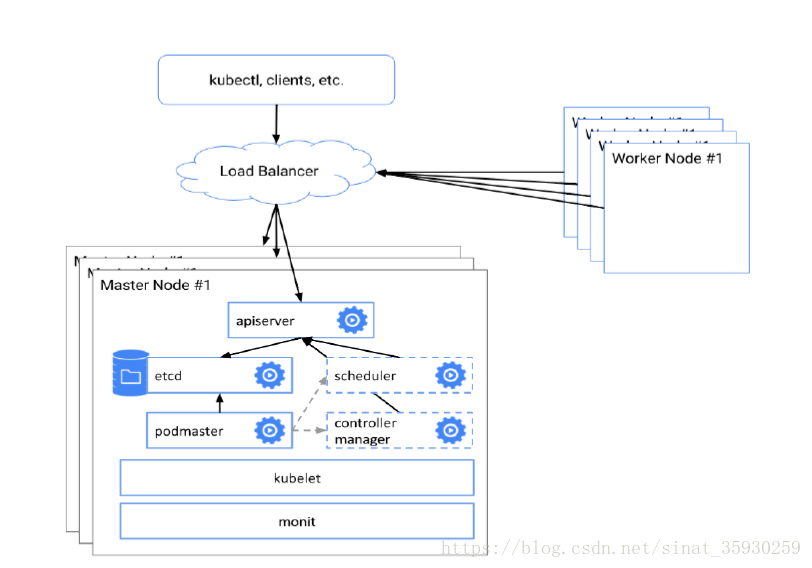
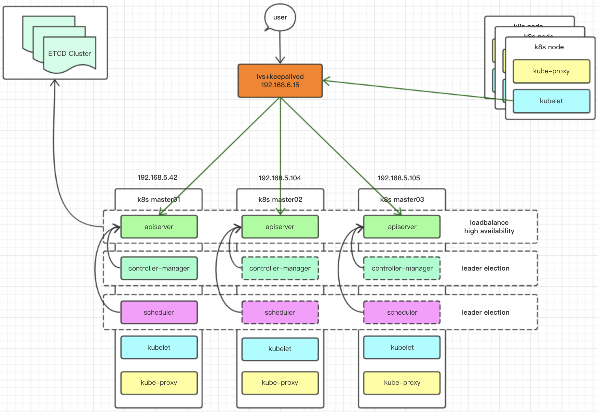

# 高可用集群

```
Date: 20191129
Author: LiuZhangshu
Version: v1.0.1
```

|  版本  |     修改内容     | 修改人 |
| :----: | :--------------: | :----: |
| v1.0.0 |       init       | 刘章术 |
| v1.0.1 | 添加所需镜像列表 | 刘章术 |
|        |                  |        |


## 1 实现方案

### 1.1 思路

apiserver：可以同时存在，通过负载均衡分配任务

etcd：集群内高可用

control-manager/scheduler：休眠状态，只有一个起作用


结论： 实现APIserver高可用即可实现kubernetes高可用



### 1.2 部署方案概述

#### 1.2.1  搭建Kubernetes集群环境方式

1. Minikube安装方式
Minikube是一个工具，可以在本地快速运行一个单点的Kubernetes，尝试Kubernetes或日常开发的用户使用。但是这种方式仅可用于学习和测试部署，**不能用于生产环境**。

2. Kubeadm安装方式
    kubeadm是一个kubernetes官方提供的快速安装和初始化拥有最佳实践（best practice）的kubernetes集群的工具，提供kubeadm init和kubeadm  join，用于快速部署Kubernetes集群。

  kubeadm的目标是提供一个最小可用的可以通过Kubernetes一致性测试的集群，所以并不会安装任何除此之外的非必须的addon。kubeadm默认情况下并不会安装一个网络解决方案，所以用kubeadm安装完之后，需要自己来安装一个网络的插件。

3. 二进制包安装方式
从官方下载发行版的二进制包，手动部署每个组件，组成Kubernetes集群，这种方式符合企业生产环境标准的Kubernetes集群环境的安装，**可用于生产方式部署**。
4. 第三方部署工具
  1. 睿云breeze：提供UI界面部署；底层调用kubeadm；基于ansible实现自动安装。


|    类型    |                             优点                             |                             缺点                             |
| :--------: | :----------------------------------------------------------: | :----------------------------------------------------------: |
|  Minikube  |                  可以快速部署单节点用于学习                  |                        无法应用于生产                        |
|  Kubeadm   | 可以通过配置文件快速安装; <br> 1.14版本后支持高可用;<br>节点扩展很方便 |    1.14之前版本不支持高可用部署;<br>网络插件需要自行部署     |
|  二进制包  |                手工安装所有组件,便于原理了解                 |                  安装流程繁琐；<br>扩展繁琐                  |
| 睿云breeze |                         有图形化界面                         | log重新做了解析,原始log查询困难不利于维护<br>只提供了安装、节点添加功能；无监控功能<br> |

**结论**：

​	minikube只能部署单节点；二进制包部署方式过程太过繁琐容易出错；<br>    第三方部署工具基本上是基于ansible的playbook完成环境部署，基于kubeadm完成部署kubernetes部署。且用户少相关文档匮乏；<br>

### 1.2.2 方案选取

安装方案：

1. 使用 haproxy+keepalived进行高可用安装

   haproxy和keepalived使用了睿云镜像包以及脚本

2. 使用kubeadm安装、扩展kubernetes；

机器资源：

| 主机名 |           用途           |           ip           |
| :----: | :----------------------: | :--------------------: |
| app91  |          主节点          |                        |
| app92  |          主节点          |                        |
| app93  |          主节点          |                        |
| app94  |         工作节点         |                        |
| app95  |         工作节点         |                        |
|   ——   | virtual IP，负载均衡地址 | 需要与app91~95同一网段 |

架构图如下：




## 2 安装

### 2.1 初始化

1. 设置系统主机名以及Host文件的相互解析

   ```bash
   hostnamectl set-hostname $hostname
   vim /etc/hosts
   ```

2. 安装依赖包

   ```bash
   yum install -y conntrack ntpdate ntp ipvsadm ipset jq iptables curl sysstat libseccomp wget vim net-tools git
   ```

3. 设置防火墙为iptables并设置空规则

   ```bash
   systemctl stop firewalld && systemctl disable firewalld
   yum -y install iptables-services && systemctl start iptables && systemctl enable iptables && iptables -F && service iptables save
   ```

4. 关闭swap，Selinux

   ```bash
   # pod可能放到虚拟内存，访问缓慢
   swapoff -a && sed -i '/ swap / s/^\(.*\)$/#\1/g' /etc/fstab
   setenforce 0 && sed -i 's/^SELINUX=.*/SELINUX=disabled/' /etc/selinux/config
   ```

5. 调整内核参数，对于K8S

   ```bash
   cat > kubernetes.conf <<EOF
   net.bridge.bridge-nf-call-iptables=1
   net.bridge.bridge-nf-call-ip6tables=1
   net.ipv4.ip_forward=1
   net.ipv4.tcp_tw_recycle=0  #由于tcp_tw_recycle与kubernetes的NAT冲突，必须关闭！否则会导致服务不通。
   vm.swappiness=0            #禁止使用 swap 空间，只有当系统 OOM 时才允许使用它
   vm.overcommit_memory=1     #不检查物理内存是否够用
   vm.panic_on_oom=0          #开启 OOM
   fs.inotify.max_user_instances=8192
   fs.inotify.max_user_watches=1048576
   fs.file-max=52706963
   fs.nr_open=52706963
   net.ipv6.conf.all.disable_ipv6=1  #关闭不使用的ipv6协议栈，防止触发docker BUG.
   net.netfilter.nf_conntrack_max=2310720
   EOF
   
   cp kubernetes.conf  /etc/sysctl.d/kubernetes.conf
    
   sysctl -p /etc/sysctl.d/kubernetes.conf 
   ```

   

6. 调整系统时区

   ```bash
   #设置为中国/上海
   timedatectl set-timezone Asia/Shanghai
   # 将当前UTC时间写入硬件时钟
   timedatectl set-local-rtc 0
   # 重启依赖系统时间服务
   systemctl restart rsyslog
   systemctl restart crond
   ```

   

7. 关闭不需要的服务

   ```bash
   systemctl stop postfix && systemctl disable postfix 
   ```

8. 设置rsyslogd和systemd journald

   ```bash
   mkdir /var/log/journal #持久化保存日志的目录
   mkdir /etc/systemd/journald.conf.d
   cat > /etc/systemd/journald.conf.d/99-prophet.conf <<EOF
   [Journal]
   # 持久化保存到磁盘
   Storage=persistent
   # 压缩历史日志
   Compress=yes
   SyncIntervalSec=5m
   RateLimitInterval=30s
   RateLimitBurst=1000     
   # 最大占用空间 10G
   SystemMaxUse=10G
   # 单日志文件最大 200M
   SystemMaxFileSize=200M
   # 日志保存时间 2 周
   MaxRetentionSec=2week
   # 不将日志转发到 syslog
   ForwardToSyslog=no
   EOF
   
   systemctl restart systemd-journald
   ```

   

9. 升级系统内核

   ```
   CentOS 7.x系统自带的3.10.x内核存在一些Bugs，导致运行的Docker、Kubernetes不稳定，例如：
   -> 高版本的 docker(1.13 以后) 启用了3.10 kernel实验支持的kernel memory account功能(无法关闭)，当节点压力大如频繁启动和停止容器时会导致 cgroup memory leak；
   -> 网络设备引用计数泄漏，会导致类似于报错：``"kernel:unregister_netdevice: waiting for eth0 to become free. Usage count = 1"``;
     
   解决方案如下：
   -> 升级内核到 4.4.X 以上；
   -> 或者，手动编译内核，disable CONFIG_MEMCG_KMEM 特性；
   -> 或者安装修复了该问题的 Docker 18.09.1 及以上的版本。但由于 kubelet 也会设置 kmem（它 vendor 了 runc），所以需要重新编译 kubelet 并指定 GOFLAGS=``"-tags=nokmem"``；
   ```

   ```bash
   uname  -r
   rpm -Uvh http://www.elrepo.org/elrepo-release-7.0-3.el7.elrepo.noarch.rpm
        
   # 安装完成后检查 /boot/grub2/grub.cfg 中对应内核 menuentry 中是否包含 initrd16 配置，如果没有，再安装一次！
   yum --enablerepo=elrepo-kernel install -y kernel-lt
        
   #设置开机从新内核启动
   grub2-set-default 0
   #重启
   reboot
      
   uname -r
   4.4.180-2.el7.elrepo.x86_64
   ```

   

10. kube-proxy开启ipvs的前置条件

    ```bash
    modprobe br_netfilter
    cat > /etc/sysconfig/modules/ipvs.modules << EOF
    #!/bin/bash
    modprobe -- ip_vs
    modprobe -- ip_vs_rr
    modprobe -- ip_vs_wrr
    modprobe -- ip_vs_sh
    modprobe -- nf_conntrack_ipv4
    EOF
    
    chmod 755 /etc/sysconfig/modules/ipvs.modules && bash /etc/sysconfig/modules/ipvs.modules && lsmod | grep -e ip_vs -e nf_conntrack_ipv4
    ```

    

11. 关闭NUMA

    ```bash
    cp /etc/default/grub{,.bak}
    vim /etc/default/grub   # GRUB_CMDLINE_LINUX="...... numa=off"即添加"numa=0ff"内容
    cp /boot/grub2/grub.cfg{,.bak}
    grub2-mkconfig -o /boot/grub2/grub.cfg #重新生成配置文件
    ```
    
    
    
12. 安装docker软件

    ```
    yum install -y yum-utils device-mapper-persistent-data lvm2
    
    yum-config-manager --add-repo http://mirrors.aliyun.com/docker-ce/linux/centos/docker-ce.repo
    
    yum update -y && yum install -y docker-ce
    #设置开机从新内核启动
    grub2-set-default 0
    #重启
    reboot
    
    #
    systemctl start docker 
    # 配置 daemon
    cat > /etc/docker/daemon.json <<EOF
    {
    	"registry-mirrors":["http://hub-mirror.c.163.com"],
    	"insecure-registries":["192.168.171.150:5000"],
    	"exec-opts":["native.cgroupdriver=systemd"],
    	"log-driver":"json-file"	,
    	"log-opts":{
    		"max-size":"100m"
    	}
    }
    EOF
    #
    mkdir -p /etc/systemd/system/docker.service.d
    systemctl daemon-reload && systemctl restart docker && systemctl enable docker 
    ```

    

    

13. 加载镜像

    ```bash
    haproxy
    keepalived
    kubeadm-basic # 1.15基础镜像
    start.keep.tar 	  #启动脚本
    
    上传到所有节点
    
    docker load {haproxy.tar,keepalived.tar,coredns.tar,etd.tar,pause.tar,apiserver.tar,proxy.tar,kubec-con-man.tar}
    ```


### 2.2 集群安装

1. haproxy和keepalived(主节点操作)

   1. haproxy

      ```bash
      # 解压 start.keep.tar
      tar -xzvf start.keep.tar
      #修改haproxy配置文件
      vim data/lb/etc/haproxy.cfg 	# 修改balance roundrobin ，负载apiserver ip；先保留一个ip
      #修改启动文件
      vim start-haproxy.sh		# 修改masterIP
      #启动 haproxy
      sh ./start-haproxy.sh
      # 查看端口是否启动
      netstat -anpt | grep :6444 
      ```

   2. keepalived

      ```bash
      # 修改启动文件 # 修改VIP，与node网段一致；修改网卡名称，INTERFACE
      sh ./start-keeplived.sh
      ```

      

2. 安装kubeadm（所有节点）

   ```bash
   cat <<EOF > /etc/yum.repos.d/kubernetes.repo
   [kubernetes]
   name=Kubernetes
   baseurl=http://mirrors.aliyun.com/kubernetes/yum/repos/kubernetes-el7-x86_64
   enabled=1
   gpgcheck=0
   repo_gpgcheck=0
   gpgkey=http://mirrors.aliyun.com/kubernetes/yum/doc/yum-key.gpg
   http://mirrors.aliyun.com/kubernetes/yum/doc/rpm-package-key.gpg
   EOF
   yum -y install kubeadm-1.15.1 kubectl-1.15.1 kubelet-1.15.1
   systemctl enable kubelet.service
   ```

   

3. 初始化主节点

   ```bash
   kubeadm config print init-defaults > kubeadm-config.yaml # 需要修改见下方
   kubeadm init --config=kubeadm-config.yaml --experimental-upload-certs | tee kubeadm-init.lo
   
   mkdir -p $HOME/.kube
   sudo cp -i /etc/kubernetes/admin.conf $HOME/.kube/config
   sudo chown $(id -u):$(id -g) $HOME/.kube/config
   
   ```

   kubeadm-config.yaml

   ```
   修改内容
   advertiseAddress: 当前节点ip
   kubernetesVersion 版本
   controlPlaneEndpoint 高可用端口
   podSubnet  pod网段
   ```

   

   ```yaml
   apiVersion: kubeadm.k8s.io/v1beta2
   bootstrapTokens:
   - groups:
     - system:bootstrappers:kubeadm:default-node-token
     token: abcdef.0123456789abcdef
     ttl: 24h0m0s
     usages:
     - signing
     - authentication
   kind: InitConfiguration
   localAPIEndpoint:
     advertiseAddress: 192.168.171.150
     bindPort: 6443
   nodeRegistration:
     criSocket: /var/run/dockershim.sock
     name: master1
     taints:
     - effect: NoSchedule
       key: node-role.kubernetes.io/master
   ---
   apiServer:
     timeoutForControlPlane: 4m0s
   apiVersion: kubeadm.k8s.io/v1beta2
   certificatesDir: /etc/kubernetes/pki
   clusterName: kubernetes
   controlPlaneEndpoint: "192.168.171.100:6444"
   controllerManager: {}
   dns:
     type: CoreDNS
   etcd:
     local:
       dataDir: /var/lib/etcd
   imageRepository: k8s.gcr.io
   kind: ClusterConfiguration
   kubernetesVersion: v1.15.1
   networking:
     dnsDomain: cluster.local
     serviceSubnet: 10.96.0.0/12
     podSubnet: "10.244.0.0/16" 
   scheduler: {}
   ---
   apiVersion: kubeproxy.config.k8s.io/v1alpha1
   kind: KubeProxyConfiguration
   featureGates:
     SupportIPVSProxyMode: true
   mode: ipvs
   ```

   

4. 其他主节点安装 haproxy，keepalived

   参见1haproxy暂定到第一个主节点，避免负载到其他节点导致的报错

5. 加入主节点以及工作节点

   执行jion命令，参见第一个主节点log内容

6. 修改haproxy配置文件，删除旧镜像，启动新镜像

   ```bash
   docker stop HAProxy-K8S
   docker rm HAProxy-K8S
   ./start-haproxy.sh
   ```

   

   配置文件如下（添加其他主节点）：

   ```
   [root@localhost etc]# cat haproxy.cfg
   global
   log 127.0.0.1 local0
   log 127.0.0.1 local1 notice
   maxconn 4096
   #chroot /usr/share/haproxy
   #user haproxy
   #group haproxy
   daemon
   
   defaults
       log     global
       mode    http
       option  httplog
       option  dontlognull
       retries 3
       option redispatch
       timeout connect  5000
       timeout client  50000
       timeout server  50000
   
   frontend stats-front
     bind *:8081
     mode http
     default_backend stats-back
   
   frontend fe_k8s_6444
     bind *:6444
     mode tcp
     timeout client 1h
     log global
     option tcplog
     default_backend be_k8s_6443
     acl is_websocket hdr(Upgrade) -i WebSocket
     acl is_websocket hdr_beg(Host) -i ws
   
   backend stats-back
     mode http
     balance roundrobin
     stats uri /haproxy/stats
     stats auth pxcstats:secret
   
   backend be_k8s_6443
     mode tcp
     timeout queue 1h
     timeout server 1h
     timeout connect 1h
     log global
     balance roundrobin
     server rancher01 192.168.171.150:6443
     server rancher02 192.168.171.151:6443
     server rancher03 192.168.171.152:6443
   
   ```

   

7. ETCD集群状态查看

   ```bash
   kubectl -n kube-system exec etcd-k8s-master01 -- etcdctl \
   --endpoints=https://192.168.171.100:2379 \
   --ca-file=/etc/kubernetes/pki/etcd/ca.crt \
   --cert-file=/etc/kubernetes/pki/etcd/server.crt \
   --key-file=/etc/kubernetes/pki/etcd/server.key cluster-health
   kubectl get endpoints kube-controller-manager --namespace=kube-system -o yaml
   kubectl get endpoints kube-scheduler --namespace=kube-system -o yaml
   ```

   

8. 部署网络

   ```
   kubectl apply -f kube-flannel.yml
   ```

   

## 附录：

### kubeadm

```
# 默认配置打印
kubeadm config print init-defaults
# 初始化主节点
kubeadm init
# 重置主节点
kubeadm reset
```

### 镜像列表

| REPOSITORY                                                   | TAG           |
| ------------------------------------------------------------ | ------------- |
| quay.io/kubernetes-ingress-controller/nginx-ingress-controller | 0.26.1        |
| quay.io/coreos/kube-state-metrics                            | v1.7.1        |
| k8s.gcr.io/kube-apiserver                                    | v1.15.1       |
| k8s.gcr.io/kube-controller-manager                           | v1.15.1       |
| k8s.gcr.io/kube-scheduler                                    | v1.15.1       |
| k8s.gcr.io/kube-proxy                                        | v1.15.1       |
| quay.io/prometheus/prometheus                                | v2.11.0       |
| quay.io/prometheus/alertmanager                              | v0.18.0       |
| quay.io/coreos/prometheus-config-reloader                    | v0.31.1       |
| quay.io/coreos/prometheus-operator                           | v0.31.1       |
| grafana/grafana                                              | 6.2.2         |
| quay.io/prometheus/node-exporter                             | v0.18.1       |
| gcr.io/google_containers/metrics-server-amd64                | v0.3.2        |
| gcr.io/kubernetes-helm/tiller                                | v2.13.1       |
| quay.io/coreos/flannel                                       | v0.11.0-amd64 |
| quay.io/coreos/kube-rbac-proxy                               | v0.4.1        |
| k8s.gcr.io/coredns                                           | 1.3.1         |
| k8s.gcr.io/kubernetes-dashboard-amd64                        | v1.10.1       |
| quay.io/coreos/k8s-prometheus-adapter-amd64                  | v0.4.1        |
| k8s.gcr.io/etcd                                              | 3.3.10        |
| k8s.gcr.io/addon-resizer                                     | 1.8.4         |
| wise2c/keepalived-k8s                                        | latest        |
| wise2c/haproxy-k8s                                           | latest        |
| k8s.gcr.io/pause                                             | 3.1           |
| quay.io/coreos/configmap-reload                              | v0.0.1        |