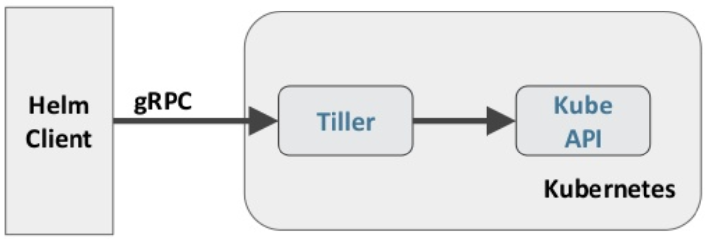

# Helm

```
Date: 20191202
Author: LiuZhangshu
Version: v1.0.0
```

|  版本  | 修改内容 | 修改人 |
| :----: | :------: | :----: |
| v1.0.0 |   init   | 刘章术 |
|        |          |        |
|        |          |        |


## 1.Helm部署与使用

### 1.1 功能

功能：Helm 本质就是让 K8s 的应用管理（Deployment,Service 等 ) 可配置，能动态生成。通过动态生成 K8s 资源清单文件（deployment.yaml，service.yaml）。然后调用 Kubectl 自动执行 K8s 资源部署

### 1.2 概念

Helm 有两个重要的概念：chart 和release

* chart 是创建一个应用的信息集合，包括各种 Kubernetes 对象的配置模板、参数定义、依赖关系、文档说

明等。chart 是应用部署的自包含逻辑单元。可以将 chart 想象成 apt、yum 中的软件安装包

* release 是 chart 的运行实例，代表了一个正在运行的应用。当 chart 被安装到 Kubernetes 集群，就生成

一个release。chart 能够多次安装到同一个集群，每次安装都是一个 release

### 1.3 组件

Helm 包含两个组件：Helm 客户端和 Tiller 服务器，如下图所示



Helm 客户端负责 chart 和 release 的创建和管理以及和 Tiller 的交互。Tiller 服务器运行在 Kubernetes 集群

中，它会处理Helm 客户端的请求，与 Kubernetes API Server 交互


## 2.Helm部署

Helm 由客户端命 helm 令行工具和服务端 tiller 组成

### 2.1 helm 安装

下载 helm 命令行工具到master 的 /usr/local/bin 下，这里下载的 2.13. 1版本

```bash
ntpdate ntp1.aliyun.com
wget https://storage.googleapis.com/kubernetes-helm/helm-v2.13.1-linux-amd64.tar.gz
tar -zxvf helm-v2.13.1-linux-amd64.tar.gz
cd linux-amd64/
cp helm /usr/local/bin	
```

### 2.2 tiller安装

需要在这台机器上配置好 kubectl 工具和 kubecong 文件，确保 kubectl 工具可以在这台机器上访问apiserver 且正常使用。

因为Kubernetes APIServer 开启了 RBAC 访问控制，直接分配cluster- admin 这个集群内置的 ClusterRole 给它。创建 rbac-config.yaml 文件：

```yaml
apiVersion: v1
kind: ServiceAccount
metadata:
  name: tiller
  namespace: kube-system
---
apiVersion: rbac.authorization.k8s.io/v1beta1
kind: ClusterRoleBinding
metadata:
  name: tiller
roleRef:
  apiGroup: rbac.authorization.k8s.io
  kind: ClusterRole
  name: cluster-admin
subjects:
  - kind: ServiceAccount
    name: tiller
    namespace: kube-system
```

```bash
kubectl create -f rbac-config.yaml 
helm init --service-account tiller --skip-refresh
```

tiller 默认被部署在 k8s 集群中的 kube-system 这个namespace 下

tiller 镜像 gcr.io/kubernetes-helm/tiller:v2.13.1

## 3. Helm自定义模板

```bash
# 创建文件夹
$ mkdir ./hello-world
$ cd ./hello-world
```

```bash
# 创建自描述文件 Chart.yaml , 这个文件必须有 name 和 version 定义
$ cat <<'EOF' > ./Chart.yaml
name: hello-world
version: 1.0.0
EOF
```

```bash
#创建模板文件， 用于生成 Kubernetes 资源清单（manifests）
$ mkdir ./templates
$ cat <<'EOF' > ./templates/deployment.yaml
apiVersion: extensions/v1beta1
kind: Deployment
metadata:
  name: hello-world
spec:
  replicas: 1
  template:
    metadata:
      labels:
        app: hello-world
    spec:
      containers:
        - name: hello-world
        image: hub.atguigu.com/library/myapp:v1
        ports:
          - containerPort: 80
          protocol: TCP
EOF
$ cat <<'EOF' > ./templates/service.yaml
apiVersion: v1
kind: Service
metadata:
  name: hello-world
spec:
  type: NodePort
  ports:
  - port: 80
    targetPort: 80
    protocol: TCP
  selector:
    app: hello-world
EOF
```

```bash
# 使用命令 helm install RELATIVE_PATH_TO_CHART 创建一次Release
$ helm install .
```

```bash
#列出已经部署的 Release
$ helm ls
#查询一个特定的 Release 的状态
$ helm status RELEASE_NAME
#移除所有与这个 Release 相关的 Kubernetes 资源
$ helm delete cautious-shrimp
# helm rollback RELEASE_NAME REVISION_NUMBER
$ helm rollback cautious-shrimp 1
#使用 helm delete --purge RELEASE_NAME 移除所有与指定 Release 相关的 Kubernetes 资源和所有这个Release的记录
$ helm delete --purge cautious-shrimp
$ helm ls --deleted
```


```bash
# 配置体现在配置文件 values.yaml
$ cat <<'EOF' > ./values.yaml
image:
  repository: gcr.io/google-samples/node-hello
  tag: '1.0'
EOF
# 这个文件中定义的值，在模板文件中可以通过 .VAlues对象访问到
$ cat <<'EOF' > ./templates/deployment.yaml
apiVersion: extensions/v1beta1
kind: Deployment
metadata:
  name: hello-world
spec:
  replicas: 1
  template:
    metadata:
      labels:
        app: hello-world
    spec:
      containers:
        - name: hello-world
        image: {{ .Values.image.repository }}:{{ .Values.image.tag }}
        ports:
          - containerPort: 8080
          protocol: TCP
EOF

# 在 values.yaml 中的值可以被部署 release 时用到的参数 --values YAML_FILE_PATH 或 --set
key1=value1, key2=value2
覆盖掉
$ helm install --set image.tag='latest' .
# 升级版本
helm upgrade -f values.yaml test
```


Debug

```bash
# 使用模板动态生成K8s资源清单，非常需要能提前预览生成的结果。
# 使用--dry-run --debug 选项来打印出生成的清单文件内容，而不执行部署
helm install . --dry-run --debug --set image.tag=lates
```


