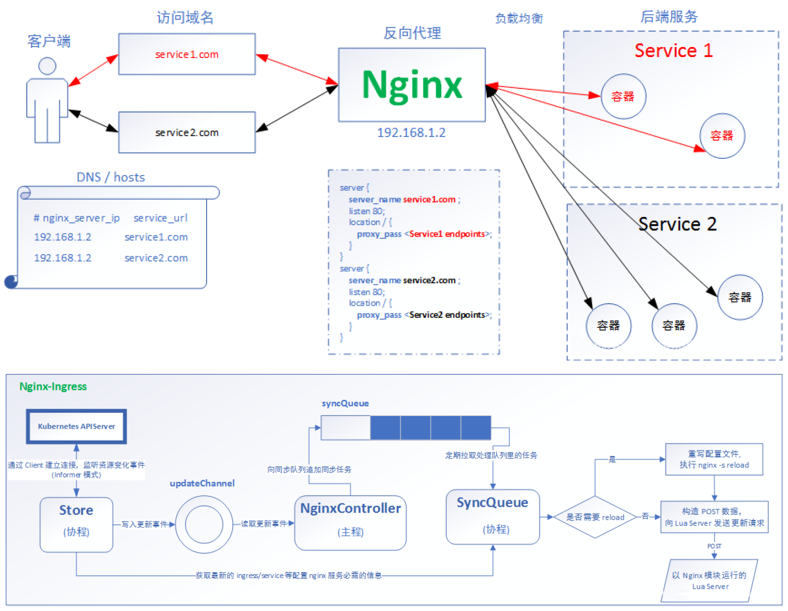

# ingress

```
Date: 20191203
Author: LiuZhangshu
Version: v1.0.0
```

|  版本  | 修改内容 | 修改人 |
| :----: | :------: | :----: |
| v1.0.0 |   init   | 刘章术 |
|        |          |        |
|        |          |        |

## 1. 原理



## 2.部署

```bash
wget https://raw.githubusercontent.com/kubernetes/ingress-nginx/master/deploy/static/mandatory.yaml
wget https://raw.githubusercontent.com/kubernetes/ingress-nginx/master/deploy/static/provider/baremetal/service-nodeport.yaml
```

```bash
kubectl apply -f mandatory.yaml
kubectl apply -f service-nodeport.yaml
```


## 3.代理

### 3.1 HTTP

deployment、Service、Ingress yaml 文件

```yaml
apiVersion: extensions/v1beta1
kind: Deployment
metadata:
  name: nginx-dm
spec:
  replicas: 2
  template:
    metadata:
      labels:
        name: nginx
    spec:
      containers:
        - name: nginx
          image: wangyanglinux/myapp:v1
          imagePullPolicy: IfNotPresent
          ports:
            - containerPort: 80
---
apiVersion: v1
kind: Service
metadata:
  name: nginx-svc
spec:
  ports:
    - port: 80
      targetPort: 80
      protocol: TCP
  selector:
      name: nginx
---
apiVersion: extensions/v1beta1
kind: Ingress
metadata:
  name: nginx-test
spec:
  rules:
    - host: www1.test.com
      http:
        paths:
        - path: /
          backend:
            serviceName: nginx-svc
            servicePort: 80
```


### 3.2 HTTPS

创建证书，以及cert 存储方式

```bash
openssl req -x509 -sha256 -nodes -days 365 -newkey rsa:2048 -keyout tls.key -out tls.crt -subj "/CN=nginxsvc/O=nginxsvc"
kubectl create secret tls tls-secret --key tls.key --cert tls.crt
```


deployment、Service、Ingress Yaml 文件

```yaml
apiVersion: extensions/v1beta1
kind: Ingress
metadata:
  name: nginx-test
spec:
  tls:
    - hosts:
      - foo.bar.com
      secretName: tls-secret
  rules:
    - host: foo.bar.com
      http:
        paths:
        - path: /
          backend:
            serviceName: nginx-svc
            servicePort: 80
```


