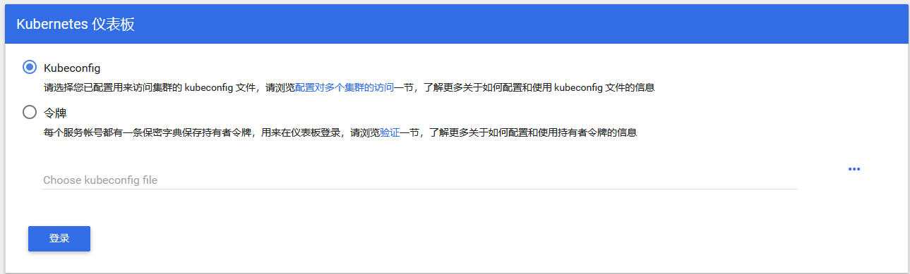

# dashborad

```
Date: 20191204
Author: LiuZhangshu
Version: v1.0.0
```

|  版本  | 修改内容 | 修改人 |
| :----: | :------: | :----: |
| v1.0.0 |   init   | 刘章术 |
|        |          |        |
|        |          |        |

## 安装

**编写kubernetes-dashboard.yaml**

```yaml
image:
  repository: k8s.gcr.io/kubernetes-dashboard-amd64
  tag: v1.10.1
ingress:
  enabled: true
  hosts:
    - k8s.frognew.com
  annotations:
    nginx.ingress.kubernetes.io/ssl-redirect: "true"
    nginx.ingress.kubernetes.io/backend-protocol: "HTTPS"
  tls:
    - secretName: frognew-com-tls-secret
  hosts:
    - k8s.frognew.com
rbac:
  clusterAdminRole: true
```

**通过helm安装**

```bash
helm fetch stable/kubernetes-dashboard
cd kubernetes-dashboard

helm install . \
-n kubernetes-dashboard \
--namespace kube-system \
-f kubernetes-dashboard.yaml
```

**访问方式修改** 

```bash
kubectl edit svc kubernetes-dashboard  -n kube-system
#修改ClusterIP 为NodePort	
```


**配置浏览器访问方式**



访问方式有两种：1.通过kubeconfig；2.通过dashboard的token访问

token查看方式如下：

```bash
# 查看token名称
[root@master1 dashboard]# kubectl -n kube-system get secret | grep kubernetes-dashboard-token

kubernetes-dashboard-token-ddtlw     kubernetes.io/service-account-token   3      16m

# 查看token内容
kubectl describe secret kubernetes-dashboard-token-ddtlw -n kube-system 
```

## 附录

下载

```
helm repo update
helm fetch stable/kubernetes-dashboard
```

CA证书位置（解决Google无法访问未认证的https站点）

```
ls /etc/kubernetes/pki/ca.crt
```


