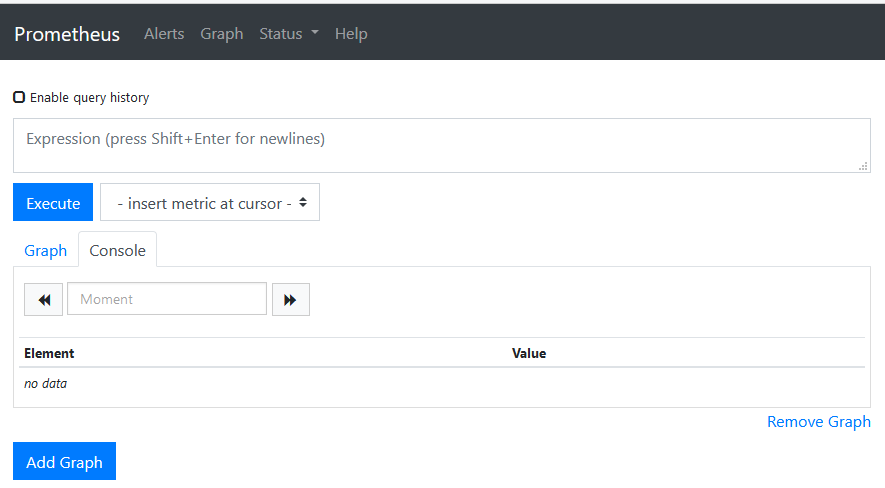
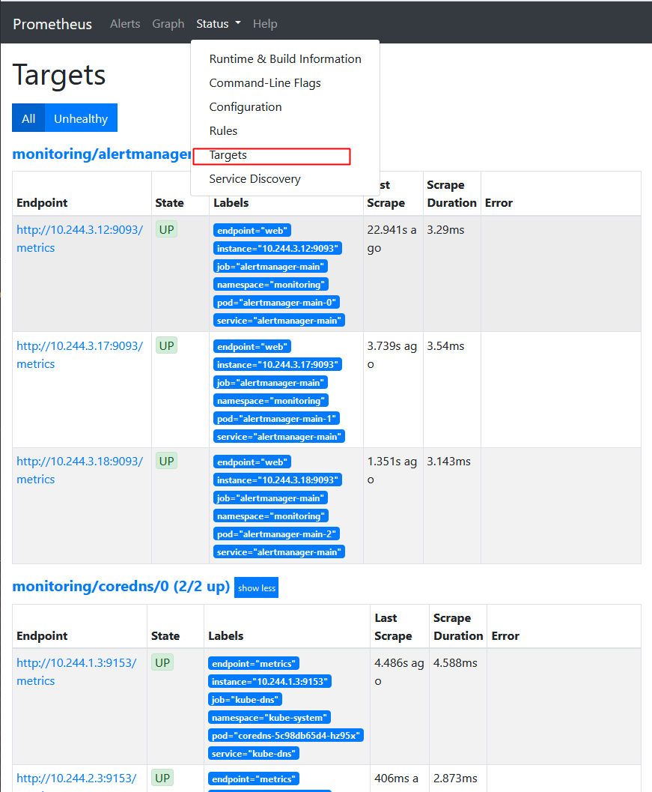
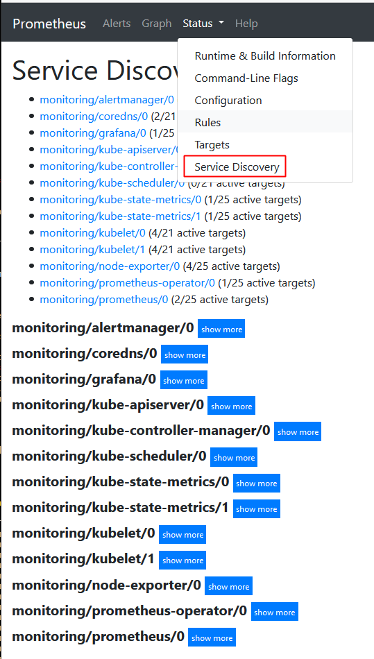

# promethues

```
Date: 20191204
Author: LiuZhangshu
Version: v1.0.0
```

|  版本  | 修改内容 | 修改人 |
| :----: | :------: | :----: |
| v1.0.0 |   init   | 刘章术 |
|        |          |        |
|        |          |        |

## 1.组件说明

1. MetricServer：是kubernetes集群资源使用情况的聚合器，收集数据给kubernetes集群内使用，如kubectl,hpa,scheduler等。 
2. PrometheusOperator：是一个系统监测和警报工具箱，用来存储监控数据。
3. NodeExporter：用于各node的关键度量指标状态数据。 
4. KubeStateMetrics：收集kubernetes集群内资源对象数据，制定告警规则。 
5. Prometheus：采用pull方式收集apiserver，scheduler，controller-manager，kubelet组件数据，通过http协议传输。 
6. Grafana：是可视化数据统计和监控平台


## 2.构建

1. 拉取工程

   ```bash
   git clone https://github.com/coreos/kube-prometheus.git
   cd kube-prometheus/manifests
   ```

2. 镜像导入

   ```bash
   docker load -i  addon-resizer.tar
   docker load -i alertmanager.tar
   docker load -i configmap-reload.tar
   docker load -i k8s-prometheus-adapter-amd64.tar
   docker load -i kube-rbac-proxy.tar
   docker load -i kube-state-metrics.tar
   docker load -i node-exporter.tar
   docker load -i prometheus-config-reloader.tar
   docker load -i prometheus-operator.tar
   docker load -i prometheus.tar
   docker load -i grafana.tar
   ```

   

3. 修改grafana-service.yaml 文件，使用 nodepode 方式访问 grafana：

   ```yaml
   apiVersion: v1
   kind: Service
   metadata:
     name: grafana
     namespace: monitoring
   spec:
     type: NodePort #添加内容
     ports:
     - name: http
       port: 3000
       targetPort: http
       nodePort: 30100  #添加内容
     selector:
       app: grafana
   ```

4. 修改prometheus-service.yaml，改为 nodepode

   ```yaml
   apiVersion: v1
   kind: Service
   metadata:
     labels:
     prometheus: k8s
     name: prometheus-k8s
     namespace: monitoring
   spec:
     type: NodePort
     ports:
     - name: web
       port: 9090
       targetPort: web
       nodePort: 30200
     selector:
       app: prometheus
       prometheus: k8s
   ```

5. 修改alertmanager-service.yaml，改为 nodepode

   ```yaml
   apiVersion: v1
   kind: Service
   metadata:
     labels:
       alertmanager: main
     name: alertmanager-main
     namespace: monitoring
   spec:
     type: NodePort
     ports:
     - name: web
       port: 9093
       targetPort: web
       nodePort: 30300
     selector:
       alertmanager: main
       app: alertmanager
     sessionAffinity: ClientIP
   ```

6. 安装资源

   ```bash
   # 需要互相链接，需要多允许几次
   kubectl apply -f ../manifests/
   
   ```

7. 访问promethues

   **promethues对应的nodeport端口为30200访问 http://masterip:30200 **

   

   **通过访问http://MasterIP:30200/target 可以看到 prometheus 已经成功连接上了 k8s 的 apiserver**

   

   **查看service-discovery**

   

   **Prometheus 自己的指标:http://master1:30200//metrics**

   

   **prometheus 的 WEB 界面上提供了基本的查询 K8S 集群中每个 POD 的 CPU 使用情况(使用PromQL)，查询条件如下**

   ```
   sum by (pod_name)( rate(container_cpu_usage_seconds_total{image!="", pod_name!=""}[1m] ))
   ```

8. 访问grafana

   **浏览器访问 http://MasterIP:30100 用户名密码默认 admin/admin**

   

   

   


## 附录

Prometheus github 地址：https://github.com/coreos/kube-prometheus