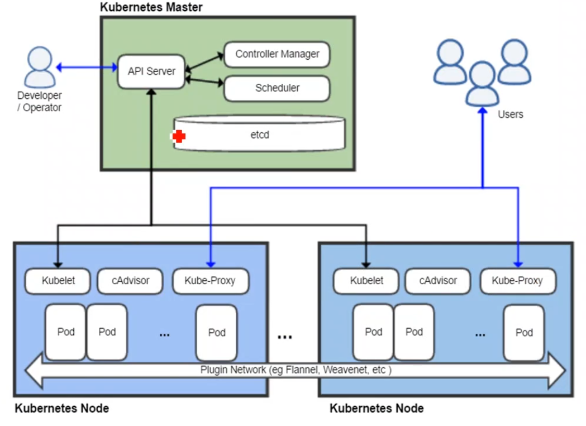
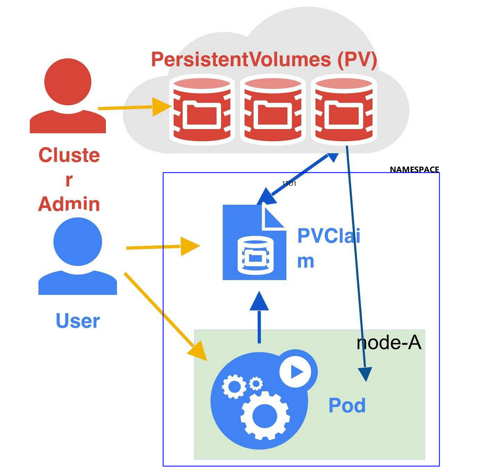
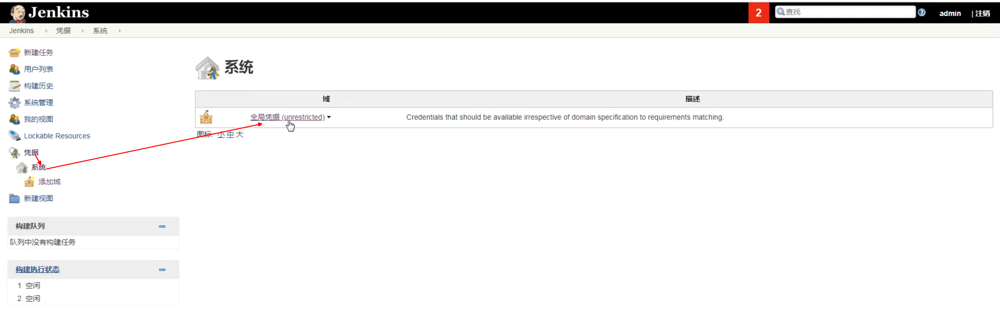
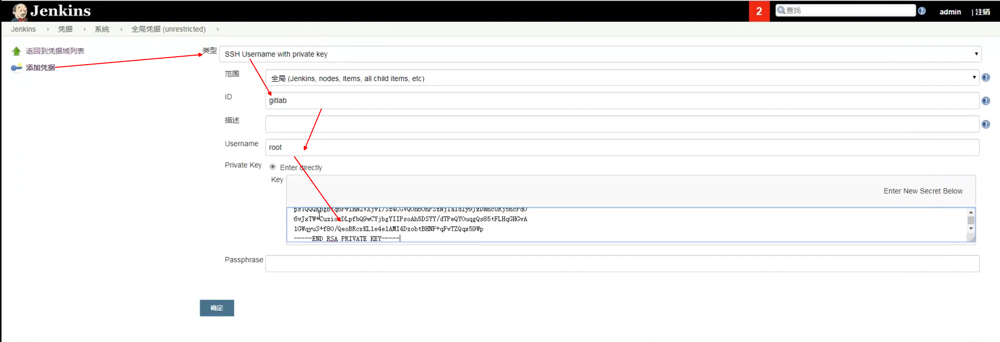
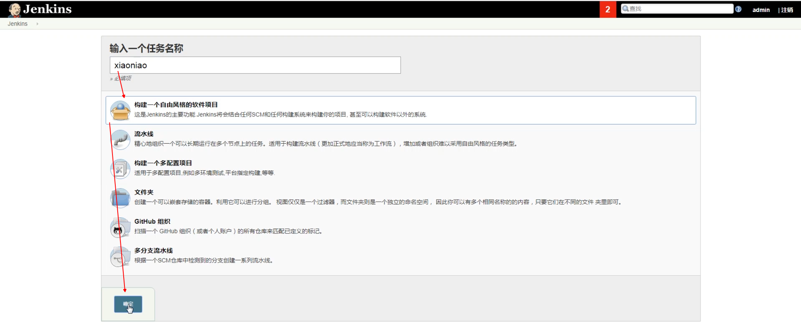
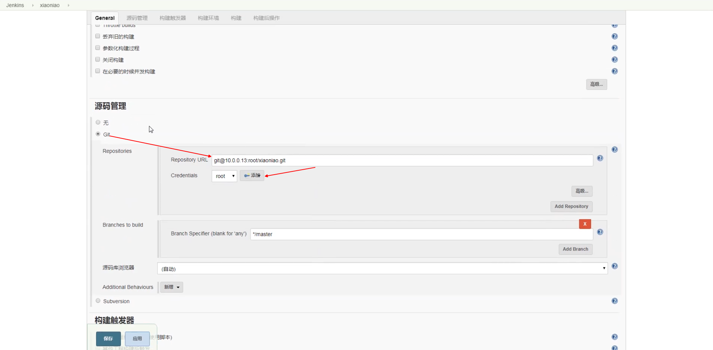
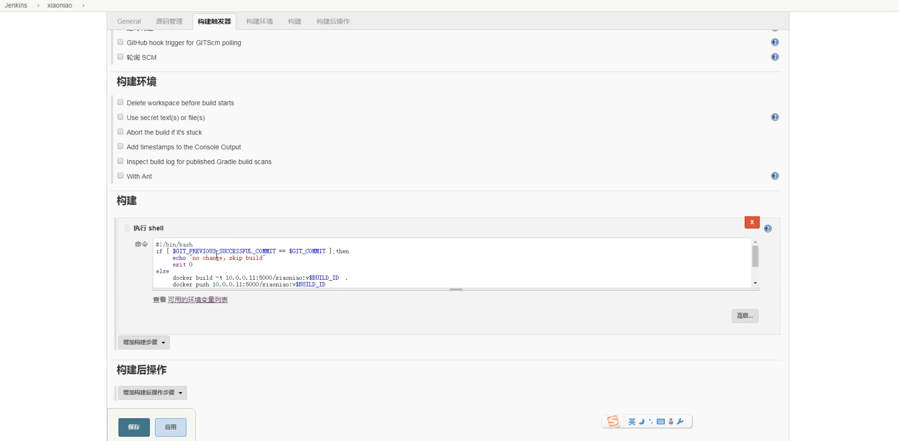
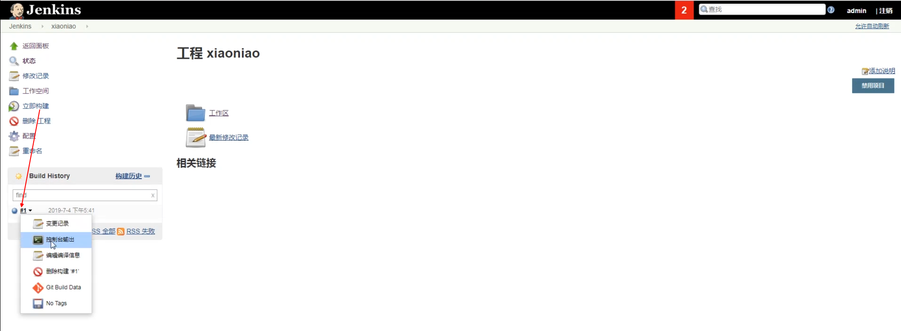
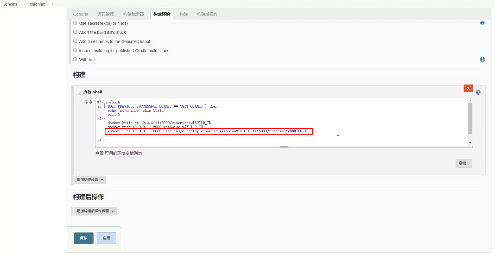

# kubernetes

---
Author : LiuZhangshu

---

## 1. kubernetes简介
### 1.1 kubernetes核心组件

| 组件名称 | 说明 | 运行位置
|:--------:|:----:|----:|
|etcd | 保存整个集群的状体 | master|
|apiserver | 提供了资源操作的唯一入库，并提供认证、授权、访问控制、API注册和发现 |master|
|control manager| 负责维护集群专题，例如故障检测，自动扩展，滚动更新|master|
|scheduler| 负责资源调度，按照预定策略将pod调度到指定的机器上 |master|
|kubelet | 负责维护容器的生命周期（新建删除监控），同事负责volume(CVI)和网络(CNI)的管理|node
|container runtime | 负责镜像管理以及pod和容器的真正运行(CRI)|node
|kube-proxy | 负责为service提供cluster内部的服务发现和负载均衡|node 



### 1.2 kubernetes扩展组件

|组件名称 | 说明 |
|:------:|:----:|
|kube-dns| 为整个集群提供DNS服务
|ingress controller | 为服务提供外网入库
|heapster|提供资源监控
|dashboard | 提供GUI
|federation | 提供跨可用区的集群
|fluentd0elasticsearch|集群日志采集存储查询

## 2. kubernetes的安装
环境预处理
```bash
//set dns
systemctl stop NetworkManager.service
systemctl disable NetworkManager.service
vim /etc/resolv.conf
systemctl stop firewalld
systemctl disable firewalld
vim /etc/sysconfig/selinux
reboot
yum install -y wget tree screen lsof tcpdump
```

### 2.1 master
#### 2.1.1 etcd

使用端口：
```
2379:对外提供服务，读写
2380：etcd集群同步使用
```

安装：
```bash
yum install -y etcd 
vim /etc/etcd/etcd.conf
```
配置：
```bash

#[Member]
#ETCD_CORS=""
# 数据存储目录
ETCD_DATA_DIR="/var/lib/etcd/default.etcd"

# 监听地址
ETCD_LISTEN_CLIENT_URLS="http://0.0.0.0:2379"
#ETCD_MAX_SNAPSHOTS="5"
#ETCD_MAX_WALS="5"
# 集群节点名称
ETCD_NAME="default"
#
#[Clustering]
#ETCD_INITIAL_ADVERTISE_PEER_URLS="http://localhost:2380"
ETCD_ADVERTISE_CLIENT_URLS="http://192.168.171.130:2379"
```
启动：
```bash
#启动
systemctl start etcd 
#开机自启动
systemctl enable etcd
#查看端口
netstat -lntup
```
#### 2.1.2 kubernetes-master
端口：
```
10250 node通信
8080 apiserver端口
```
安装：
```bash
yum install kubernetes-master.x86_64 -y
```
配置：
```bash
[root@k8s_master ~]# vim /etc/kubernetes/apiserver
# The address on the local server to listen to.
KUBE_API_ADDRESS="--insecure-bind-address=0.0.0.0"

# The port on the local server to listen on.
KUBE_API_PORT="--port=8080"

# Port minions listen on(node节点)
KUBELET_PORT="--kubelet-port=10250"

# Comma separated list of nodes in the etcd cluster
KUBE_ETCD_SERVERS="--etcd-servers=http://192.168.171.130:2379"

# Address range to use for services  # cluster ip范围
KUBE_SERVICE_ADDRESSES="--service-cluster-ip-range=10.254.0.0/16"

# default admission control policies (删除ServiceAccount)
KUBE_ADMISSION_CONTROL="--admission-control=NamespaceLifecycle,NamespaceExists,LimitRanger,SecurityContextDeny,ServiceAccount,ResourceQuota"

# Add your own! 
#
#更改默认端口范围   --service-node-port-range=10000-60000
KUBE_API_ARGS=""

```

```bash
[root@k8s_master ~]# vim /etc/kubernetes/config

###
# kubernetes system config
#
# The following values are used to configure various aspects of all
# kubernetes services, including
#
#   kube-apiserver.service
#   kube-controller-manager.service
#   kube-scheduler.service
#   kubelet.service
#   kube-proxy.service
# logging to stderr means we get it in the systemd journal
KUBE_LOGTOSTDERR="--logtostderr=true"

# journal message level, 0 is debug
KUBE_LOG_LEVEL="--v=0"

# Should this cluster be allowed to run privileged docker containers
KUBE_ALLOW_PRIV="--allow-privileged=false"

# How the controller-manager, scheduler, and proxy find the apiserver
KUBE_MASTER="--master=http://192.168.171.130:8080"
```
启动：
```
systemctl start kube-apiserver.service
systemctl start kube-controller-manager.service
systemctl start kube-scheduler.service

systemctl enable kube-apiserver.service
systemctl enable kube-controller-manager.service
systemctl enable kube-scheduler.service
```
检查状态：
```bash
kubectl get componentstatus
```

### 2.2 node

安装：
```bash
yum install kubernetes-node.x86_64 -y 
```
配置：
```bash
[root@k8s_master ~]# vim /etc/kubernetes/config
[root@k8s_master ~]# vim /etc/kubernetes/kubelet
###
# kubernetes kubelet (minion) config

# The address for the info server to serve on (set to 0.0.0.0 or "" for all interfaces)（kubelet端口配置）
KUBELET_ADDRESS="--address=192.168.171.130"

# The port for the info server to serve on
KUBELET_PORT="--port=10250"

# You may leave this blank to use the actual hostname  (区分不同node)
KUBELET_HOSTNAME="--hostname-override=k8s_master"

# location of the api-server
KUBELET_API_SERVER="--api-servers=http://192.168.171.130:8080"

# pod infrastructure container（需要修改为docker.io/tianyebj/pod-infrastructure  ）
KUBELET_POD_INFRA_CONTAINER="--pod-infra-container-image=docker.io/tianyebj/pod-infrastructure:latest"

# Add your own!
KUBELET_ARGS=""
```
启动：
```bash
systemctl start kubelet.service
systemctl enable kubelet.service
systemctl start kube-proxy.service
systemctl enable kube-proxy.service
```

验证：
```bash
kubectl get nodes
kubectl delete nodes [nodename]
```

### 2.3 flanel网络（所有节点）
目的：实现跨docker宿主机容器互访

安装：
```
yum install -y flannel 
```
配置：
```bash
[root@k8s_master ~]# vim /etc/sysconfig/flanneld
# Flanneld configuration options

# etcd url location.  Point this to the server where etcd runs
FLANNEL_ETCD_ENDPOINTS="http://192.168.171.130:2379"

# etcd config key.  This is the configuration key that flannel queries
# For address range assignment
FLANNEL_ETCD_PREFIX="/atomic.io/network"

# Any additional options that you want to pass
#FLANNEL_OPTIONS=""
```
```bash
#etcd中设置key FLANNEL_ETCD_PREFIX,设置flannel IP范围
etcdctl set /atomic.io/network/config '{"Network":"172.16.0.0/16"}'
```
启动：
```bash
systemctl start flanneld.service
systemctl enable flanneld.service
#使docker网段与flannel一致
systemctl restart docker 
```

测试：
```bash
docker pull busybox
docker run -it --rm busybox 
ifconfig

ping 

```
解决容器之间无法ping通
```
iptable -P FORWARD ACCECPT

vim /usr/lib/systemd/system/docker.service
#添加
ExecStartPost=/usr/sbin/iptables -P FORWARD ACCEPT

systemctl daemon-reload
```

## 3.k8s常用资源的使用

### 3.1 创建pod
```bash
vi nginx_pod.yaml
```
```yaml
apiVersion: v1                      #版本
kind: Pod                           #资源类型
metadata:                           #属性
    name: nginx                     #pod name
    labels:
        app: web
spec:                               #详细
    containers:
      - name: nginx                 #容器名  ## -代表列表资源
        image: 192.168.171.130/nginx:1.13           #镜像
        ports:                     #端口
          - containerPort: 80
```
```bash
# 新建
kubectl create -f nginx_pod.yaml
# 查看pod
kubectl get pods 
# 查看指定pod ； -o wide 显示更多
kubectl get pod [pod name]  -o wide

# 显示更多信息
kubectl describe pod [pod name]
# 删除，grace-period回收 --all 删除所有 , -f 通过yaml删除
kubectl delete pod [pod name] --forece --grace-period=0 
# 描述
kubectl describe pod [pod name]
# 根据新yaml文件更新pod
kubectl apply -f [yaml dir] 
# 复制文件到pod
kubectl cp [file path] [pod name]:[path]
# 连接
kubectl exec -it [pod name] -c [container name] [cmd]

```
### 3.2 pod详解
查看
```bash
docker inspect [container id] | grep -i network|ipaddress
```
现象：
```bash
#nginx可以访问
curl [ngix ip ]
# 容器ps
nginx container:pod
pod   ip
```
tips：
```
容器网络类型container，公用IP，端口先到先得
```

结论：
```
k8s新建pod时，会控制 kubelet在node节点至少创建两个容器：业务容器、基础pod容器

pod容器支持k8s高级功能（自动回滚、扩容、）

pod和业务容器通过container网络类型绑定


```
### 3.3 Pod常用操作

最多4个业务容器

```bash
vi nginx_pod.yaml
```
```yaml
apiVersion: v1                      #版本
kind: Pod                           #资源类型
metadata:                           #属性
    name: test                     #pod name
    labels:
        app: web
spec:                               #详细
    containers:
      - name: nginx                 #容器名  ## -代表列表资源
        image: 192.168.171.130:5000/nginx:1.13           #镜像
        ports:                     #端口
          - containerPort: 80
      - name: busybox                 #容器名  ## -代表 列表 资源
        image: 192.168.171.130:5000/busybox:latest           #镜像
        imagePullPolicy: IfNotPresent             # option,镜像更新策略
        command: ["sleep","3600"]                               #启动后执行命令
        ports:                     #端口
          - containerPort: 8081
``` 

tips：
```
kubectl explain 
```

### 3.4 Replication Controller

原理：监控pod运行状态，如果异常，在其他节点运行，保证高可用；滚动升级，升级回滚

pod和RC用label关联，如果>副本数 会删除最年轻的pod
#### 3.4.1 创建RC
```bash
mkdir RC 
vim nginx-rc.yaml
```
```yaml
apiVersion: v1                            # 版本
kind: ReplicationController               # 资源类型
metadata:                                 # 属性
  name: myweb                             # 名称
spec:                 
  replicas: 2                             # 副本数
  selector:                               # 选择器
    app: myweb                            # 管理标签   
  template:                               # 启动模板
    metadata:
      labels:
        app: myweb                        #  容器label
    spec:
      containers:
      - name: myweb
        image: 192.168.171.130:5000/nginx:1.13
        ports:
        -  containerPort: 80
```
```bash
# 创建RC
kubectl create -f [RC dir]
# 查看
kubectl get rc
# pod名称 rcname-随机值

# 修改pod资源
kubectl edit  pod [pod name]
```
#### 3.4.2 滚动升级

```bash
vim nginx-rc2.yaml
```
```yaml
apiVersion: v1                            # 版本
kind: ReplicationController               # 资源类型
metadata:                                 # 属性
  name: myweb2                             # 名称
spec:                 
  replicas: 2                             # 副本数
  selector:                               # 选择器
    app: myweb2                            # 管理标签   
  template:                               # 启动模板
    metadata:
      labels:
        app: myweb2                        #  容器label
    spec:
      containers:
      - name: myweb2
        image: 192.168.171.130:5000/nginx:1.15
        ports:
        -  containerPort: 80
```
```bash
# 滚动升级 --update-period升级间隔(默认1min)，新的存活超过设定值，删除一个
kubectl rolling-update [old rc name] -f [new yaml dir]  --update-period=30s

kubectl get pods
# 回滚
kubectl rolling-update [new rc name ] -f [old rc yaml dir]  --update-period=1s

# 中断
kubectl rolling-update [old rc name] [new rc name] --rollback
```
### 3.5 service资源

目的：仅仅在集群内可以访问

clusterIP范围 : 10.254.0.0/16

podip <=====> clusterIP(负载均衡，rr轮询) <=======> nodeip
#### 3.5.1 service安装
```bash
# 查看所有资源
kubectl get all 
mkdir svc
vi nginx-svc.yaml
```
```yaml
apiVersion: v1        # 版本
kind: Service         #  资源类型
metadata:
  name: myweb
spec:
  type: NodePort      # 类型 nodeport：端口映射
  ports:
    - port: 80            # clusterip端口
      nodePort: 30000     # 宿主机（任意宿主机）端口;范围30000-32767；
      targetPort: 80      # podip端口
  selector:
    app: myweb
```
```bash
# 启动
kubectl create -f nginx-svc.yaml
# 查看
kube describe svc [svc name]

```
### 3.5.2 服务自动发现发现

只需要服务启动，自动调度;调度会保持长连接，持续一段时间

```bash
# 添加副本
kubectl scale rc [rc name] --replicas=3
kubectl get pod -o wide 
kubectl describe svc myweb
 
```
### 3.6 deployment资源

保证pod高可用；解决RC升级后，SVC未更新label，导致不可用
#### 3.6.1 安装

Deployment会启动rs，rs启动pod

```bash
mkdir deploy
vi nginx-deploy.yaml
```
```yaml
apiVersion: extensions/v1beta1
kind: Deployment
metadata:
  name: nginx-deployment
spec:
  replicas: 3
  template:
    metadata:
      labels:
        app: nginx
    spec:
      containers:
      - name: nginx
        image: 192.168.171.130:5000/nginx:1.13
        ports:
        - containerPort: 80
```
```bash
kubectl create -f nginx-deploy.yaml
```
svc关联
```bash
# kubectl expose deployment [deployment name] --port=80 --type=NodePort
kubectl expose deployment nginx-deployment --port=80 --type=NodePort --target-port=80

curl -I 
```
升级,使用新的rs代替旧的rs
```bash
kubectl edit deployment [deploy name]
```
回滚
```bash
# 回滚
kubectl rollout undo deployment nginx-deployment
# 历史版本
kubectl rollout history deployment [deployment name]
```

最佳实践
```bash
#启动deployment   --recode版本
kubectl run nginx --image=192.168.171.130:5000/nginx:1.13 --port=80 --replicas=3 --record
kubectl delete deployment nginx

#升级 deployment name ,container name=镜像版本
kubectl set image deploy nginx nginx=192.168.171.130:5000/nginx:1.15 --recode

# 回滚都指定版本
kubectl rollout undo deployment nginx --to-revision=3

```

### 3.7 tomcat+mysql

mysql-rc.yml
```yaml
apiVersion: v1
kind: ReplicationC
metadata:
  name: mysql
  selector:
    app: mysql
  template:
    metadata:
      labels:
        app: mysql
      spec:
        containers:
          - name: mysql
            image: 192.168.171.130:5000/mysql:5.7
            ports: 3306
            env:
            - name: MYSQL_ROOT_PASSWORD
              value: '123456'
```
```yaml
apiVersion: v1        # 版本
kind: Service         #  资源类型
metadata:
  name: mysql
spec:
  type: NodePort      # 类型 nodeport：端口映射
  ports:
    - port: 3306            # clusterip端口
      nodePort: 30000     # 宿主机（任意宿主机）端口;范围30000-32767；
      targetPort: 3306      # podip端口
  selector:
    app: mysql
```
tomcat-rc.yaml
```yaml
apiVersion: v1
metadata:
  name: myweb
  selector:
    app: myweb
  template:
    metadata:
      labels:
        app: myweb
    spec:
      containers:
        - name: myweb
          images: 
          ports:
          - containerPort: 8080
          env:
          - name: MYSQL_SERVICE_HOST
            value: clusterip
          - name: MYSQL_SERVICE_PORT
            value: 3306

```
tomcat-svc.yaml
```yaml
apiVersion: v1
kind: Service
metadata:
  name: myweb
spec:
  type: NodePort
  ports:
    - port: 8080
      nodePort: 30008
      targetPort: 8080
  selector:
    app: myweb
```
```bash
kubectl create -f mysql-rc.yaml
kubectl create -f mysql-svc.yaml
```

## 4. kubernetes 弹性伸缩

### 4.1 DNS组件

目的： k8s支持两种service的发现机制：环境变量和DNS；当service变的庞大后，环境变量会过多

#### 4.4.1 DNS安装

下载地址：
```
www.qstack.com.cn/skydns.zip
```
修改 skydns-rc.yaml
```yaml
# 指向本地apiserver
- --kube-master-url=http://192.168.171.130:8080
```
修改skydns-svc.yaml
```yaml
# 挑选未占用的
clusterIP=10.254.230.254
```

```bash
kubectl create -f skydns-rc.yaml
kubectl create -f skydns-svc.yaml
 
kubectl get pod --namespace=kube-system
```

修改所有的kubelet节点,/etc/kubernetes/kubelet
```
KUBELET_ARGS="--cluster_dns=10.254.230.254 --cluster_domain=cluster.local"
```
重启所有node节点kubelet：
```bash
systemctl restart kubelet
```
验证
```
kubectl get svc
kubectl create -f test_dns_pod.yaml
kubectl get pods
kubectl exec -it busybox /bin/bash
nslookup test
```
tips:
```
cluster ip可以用service名称替代
```

### 4.2 pod健康度检查

探针的种类：

* livenessProbe:健康状态检查，周期性检查服务是否存活，检查结果失败，将重启容器
* readProbe:可用性检查，周期性检查服务是否可用，不可用将从service的endpoint删除

探针的检查方法

* exec：执行一段命令
* httpGet：检测某个http请求的返回状态码
* tcpSocket:测试某个端口是否能够连接

#### 4.2.1 livenessProbe

安装：

* exec :检测命令是否成功执行
```bash
mkdir health
vi pod_nginx_exec.yaml
```
```yaml
apiVersion: v1
kind: Pod
metadata:
  name: exec 
spec:
  containers:
    - name: nginx
      image: 192.168.171.130:5000/nginx:1.13
      ports:
        - containerPort: 80
      args:                       #容器初始命令                  
        - /bin/sh
        - -c
        - touch /tmp/healthy; sleep 30;rm -rf /tmp/healthy; sleep 600
      livenessProbe:        # 探针
        exec:               # 执行方式
          command:                # 执行命令
            - cat
            - /tmp/healthy
        initialDelaySeconds: 5  # 初始化间隔
        periodSeconds: 5       # 5s检查一次
```
```bash 
kubectl create -f pod_nginx_exec.yaml
```
* httpGet ： 检测网站是否在200~300；400~500报错
```bash
vim nginx_pod_httpGet.yaml
```
```yaml
apiVersion: v1
kind: Pod
metadata:
  name: httpget     # 小写
spec:
  containers:
    - name: nginx
      image: 192.168.171.130:5000/nginx:1.13
      ports:
        - containerPort: 80
      livenessProbe:
        httpGet:
          path: /index.html
          port: 80
        initialDelaySeconds: 3
        periodSeconds: 3
```
* tcpSocket : 检测端口是否开启

```bash
vim nginx_pod_httpGet.yaml
```
```yaml
apiVersion: v1
kind: Pod
metadata:
  name: httpget     # 小写
spec:
  containers:
    - name: nginx
      images: 192.168.171.130:5000/nginx:1.13
      ports:
        - containPort:80
      livenessProbe:
        tcpSocket:
          port: 80
        initalDelaySeconds: 3
        periodSeconds: 3
```

#### 4.2.2 readinessProbe
安装

* httpGet 不存在无法加入svc,存在则加入 svc的endpoints

```bash
vim nginx-rc-readiness.yaml
```
```yaml
apiVersion: v1
kind: ReplicationController
metadata:
  name: readiness     # 小写
spec:
  replicas: 2
  selector:
    app: readiness
  template:
    metadata:
      labels:
        app: readiness
    spec:
      containers:
        - name: nginx
          image: 192.168.171.130:5000/nginx:1.13
          ports:
            - containerPort: 80
          readinessProbe:
            httpGet:
              path: /test.html
              port: 80
            initialDelaySeconds: 3
            periodSeconds: 3

```
```bash
kubectl create -f nginx-rc-readiness.yaml
kubectl expose rc readiness --port=80
kubectl get svc
kubectl describe svc readiness
```
### 4.3 dashboard部署

安装
```bash
wget https://www.qstack.com.cn/dashboard.zip
docker pull ist0ne/kubernetes-dashboard-amd64:v1.4.2
docker tag docker.io/ist0ne/kubernetes-dashboard-amd64:v1.4.2   192.168.171.130:5000/kubernetes-dashboard-amd64:v1.4.2
docker push 192.168.171.130:5000/kubernetes-dashboard-amd64:v1.4.2
```
修改 dashboard-deploy.yaml
```yaml
image: 192.168.171.130:5000/kubernetes-dashboard-amd64:v1.4.2

--apiserver-host=https://192.168.171.130:8080
```
检查：
```bash
kubectl get all --namepspace=kube-system
```
访问 https://192.168.171.130:8080/ui


### 4.4 namespace

作用：实现多租户资源隔离

命令：
```bash
# 创建
kubectl  create namespace [namespace name]
# 查看
kubectl get namespace
# 删除 会删除namespace下所有资源
kubectl  delete namespace [namespace name]
# namespace下操作
kubectl get all --namespace=kube-system
# 所有namespace下
kubectl get all --all-namespaces
```
使用：
```bash
mkdir namespace && cd namespace
cp ../rc/nginx-rc.yaml .
cp ../svc/nginx-svc.yaml .
```
* nginx-rc.yaml
```yaml
apiVersion: v1                            # 版本
kind: ReplicationController               # 资源类型
metadata:                                 # 属性
  name: myweb                             # 名称
  namespace: test
spec:
  replicas: 2                             # 副本数
  selector:                               # 选择器
    app: myweb                            # 管理标签
  template:                               # 启动模板
    metadata:
      labels:
        app: myweb                        #  容器label
    spec:
      containers:
      - name: myweb
        image: 192.168.171.130:5000/nginx:1.13
        ports:
        -  containerPort: 80
```
* nginx-svc.yaml
```yaml
apiVersion: v1        # 版本
kind: Service         #  资源类型
metadata:
  name: myweb
  namespace: test
spec:
  type: NodePort      # 类型 nodeport：端口映射
  ports:
    - port: 80            # clusterip端口
      nodePort: 30000     # 宿主机（任意宿主机）端口;范围30000-32767；
      targetPort: 80      # podip端口
  selector:
    app: myweb

```

### 4.5 反向代理proxy方式访问

访问方式：
* NodePort：使用宿主机IP
```yaml
type: NodePort
  ports:
    - port: 80
      target: 80
      nodePort: 30008
```
* clusterIP（默认）：通过proxy反向代理
```yaml
type: ClusterIP
  ports:
    - port: 80
      targetPort: 80
```

访问演示：
```bash
# [apiserverIP]/api/v1/proxy/namespaces/[namespace name]/service/[service name]
http://192.168.171.130:8080/api/v1/proxy/namespaces/test/services/myweb
```

### 4.6 k8s 监控服务 heapster
#### 4.6.1安装
组件：
```
influxdb
grafana
heapster
```
下载
```bash
wget https://www.qstack.com.cn/heapster-influxdb.zip
 image: kubernetes/heapster:canary
image: kubernetes/heapster_influxdb:v0.5
image: kubernetes/heapster_grafana:v2.6.0

```
修改 vim heapster-controller.yaml
```yaml
- --source=kubernetes:http://[apiServer]?in......

```
创建
```bash
kubectl create -f .
```
查看dashboard

原因cadvisor集成到kubelet，只能内部访问，外部需要添加 --cadvisor-port=8080 kube——argus


### 4.7 弹性伸缩（hpa:horizontal pod autoscaler）

原理：监控cpu使用率，增加pod；数据来源于heapster

```bash
vim nginx-rc.yaml
```
```yaml
apiVersion: v1                            # 版本
kind: ReplicationController               # 资源类型
metadata:                                 # 属性
  name: myweb                             # 名称
spec:
  replicas: 2                             # 副本数
  selector:                               # 选择器
    app: myweb                            # 管理标签
  template:                               # 启动模板
    metadata:
      labels:
        app: myweb                        #  容器label
    spec:
      containers:
      - name: myweb
        image: 192.168.171.130:5000/nginx:1.13
        ports:
        -  containerPort: 80
        resources:
          limits:
            cpu: 100m
            memory: 50Mi
          requests:
            cpu: 100m
            memory: 50Mi
```
```bash
kubectl create -f nginx-rc.yaml
```

hpa创建：
```bash
# kubectl autoscaler [resource type] [resource name] --max=8 --min=1 --cpu-percent=[threshold value] 
# cpu-percent 建议值60%
kubectl autoscale rc myweb --max=8 --min=1 --cpu-percent=10
```
压力测试：
```bash
yum install httpd-tools -y
# -n 申请次数 -c每次申请并发数
ab -n 500000 -c 100 http://

```
## 5 k8s 持久化存储
### 5.1 k8s存储 pvc和pv
利用共享存储完成持久化

#### pv和pvc

* PersistentVolume(pv)：由管理员添加的一个存储描述，是全局资源包含存储的类型、大小、访问模式。生命周期独立于pod，pod销毁对pvc没有影响
* PersistentVolumeClai(pvc)：namespace中的资源，描述对pv的一个请求。请求信息包含存储大小，访问模式；
* tips：
```
1. pv和pvc一一绑定
2. 创建pod时，按照需求在pv池中选取pv,优先选小的
```

### 5.1.1 创建PV
#### 5.1.1.2 nfs安装：

安装：
```bash
yum install nfs-utils -y 
```
配置：
```bash
vim /etc/exports
```
```t
# 共享目录  IP白名单网段(读写，同步,不做root uid映射，不做其他用户uid映射)
/data 192.168.171.0/24(rw,async,no_root_squash,no_all_squash)
```
```bash
# 创建共享目录
mkdir -p /data/k8s 
systemctl restart rpcbind
# 通知nfs端口 ip
systemctl restart nfs
# 其他机器检查
showmount -e 192.168.171.130
```
tips：
```bash
# clnt_create: RPC: Program not registered
# master执行
[root@k8s_master hpa]# systemctl stop  nfs
[root@k8s_master hpa]# systemctl stop  rpcbind
[root@k8s_master hpa]# systemctl start rpcbind
[root@k8s_master hpa]# systemctl start nfs
```
#### 5.1.1.3 pv创建
```bash
mkdir volume
vim test-pv.yaml
```
```yaml
apiVersion: v1
kind: PersistentVolume
metadata:
  name: test 
  labels:
    type: test
spec:
  capacity:
    storage: 10Gi
  accessModes:
    - ReadWriteMany
  persistentVolumeReclaimPolicy: Recycle #回收策略
  nfs: 
    path: "/data/k8s"
    server: 192.168.171.130
    readOnly: false
```
```bash
vim test-pv2.yaml
```
```yaml
apiVersion: v1
kind: PersistentVolume
metadata:
  name: test2 
  labels:
    type: test
spec:
  capacity:
    storage: 5Gi
  accessModes:
    - ReadWriteMany
  persistentVolumeReclaimPolicy: Recycle #回收策略
  nfs: 
    path: "/data/k8s"
    server: 192.168.171.130
    readOnly: false
```
```bash
vim test-pvc.yaml
```
```yaml
apiVersion: v1
kind: PersistentVolumeClaim
metadata:
  name: nfs 
spec:
  accessModes:
    - ReadWriteMany
  resources:
    requests:
      storage: 1Gi
```
```bash
kubectl create -f test-pv.yaml
kubectl create -f test-pv2.yaml
kubectl create -f test-pvc.yaml
# 查看
kubectl get pv
kubectl get pvc
# 创建6g pv
kubectl create -f test-pv3.yaml
# 创建7g pvc
kubectl create -f test-pvc2.yaml
# 查看
```

## 5.2 k8s持久化样例
mysql_pv.yaml;
```yaml
apiVersion: v1
kind: PersistentVolume
metadata:
  name: mysql 
  labels:
    type: mysql
spec:
  capacity:
    storage: 10Gi
  accessModes:
    - ReadWriteMany
  persistentVolumeReclaimPolicy: Recycle #回收策略
  nfs: 
    path: "/data/mysql"
    server: 192.168.171.130
    readOnly: false
```
mysql_pvc.yaml
```yaml
apiVersion: v1
kind: PersistentVolumeClaim
metadata:
  name: mysql-pvc 
spec:
  accessModes:
    - ReadWriteMany
  resources:
    requests:
      storage: 1Gi
```
mysql-rc-pvc.yml
```yaml
apiVersion: v1
kind: ReplicationController
metadata:
  name: mysql
spec:
  replicas: 1
  selector:
    app: mysql
  template:
    metadata:
      labels:
        app: mysql
    spec:
      containers:
        - name: mysql
          image: 192.168.171.130:5000/mysql:5.7
          ports: 
            - containerPort: 3306
          env:
          - name: MYSQL_ROOT_PASSWORD
            value: '123456'
          volumeMounts:
          - name: data                  # 名称
            mountPath: /var/lib/mysql   # 需要持久化的容器内部目录
      volumes:       # pvc配置
      - name: data      #需要与volumeMounts.name一致
        persistentVolumeClaim:
          claimName: mysql-pvc  #配置pvc
```
mysql-svc.yml
```yaml
apiVersion: v1        # 版本
kind: Service         #  资源类型
metadata:
  name: mysql
spec:
  type: NodePort      # 类型 nodeport：端口映射
  ports:
    - port: 3306            # clusterip端口
      nodePort: 30000     # 宿主机（任意宿主机）端口;范围30000-32767；
      targetPort: 3306      # podip端口
  selector:
    app: mysql
```


## 6 k8s的持续发布

### 6.1 gitlab
### 6.1.1 gitlab部署
```bash
wget https://mirrors.tuna.tsinghua.edu.cn/gitlab-ce/yum/el7/gitlab-ce-10.0.0-ce.0.el7.x86_64.rpm
yum localinstall ./gitlab-ce-10.0.0-ce.0.el7.x86_64.rpm
vim /etc/gitlab/gitlab.rb
# 修改 external_url
##  修改 prometheus_monitoring['enable'] = false
gitlab-ctl reconfigure
```
### 6.2 jenkins 部署
1. jdk部署
```bash
yum localinstall jdk-8u231-linux-x64.rpm
```
2. jenkins
```bash
cd /etc/yum.repos.d/
wget http://pkg.jenkins.io/redhat/jenkins.repo
rpm --import http://pkg.jenkins.io/redhat/jenkins.io.key
yum install -y jenkins
```
配置
```

```


### 6.3 jenkins 自动化构建

1. 配置gitlab公钥

2. 配置jenkins自动化








### 6.4 k8s应用版本升级
创建APP
```bash
kubectl run xiaoniao --image=192.168.171.130:5000/xiaoniao:v1 --replicas=2 --record
kubectl expose deploy xiaoniao --port=80 --type=NodePort
```
jenkins配置



## 7 
### 7.1 helm


helm
```
wget https://storage.googleapis.com/kubernetes-helm/helm-v2.13.1-linux-amd64.tar.gz
cp helm /usr/local/bin/
vim rbac-config.yaml
```
```yaml
apiVersion: v1
kind: ServiceAccount
metadata:
  name: tiller
  namespace: kube-system
---
kind: ClusterRoleBinding
apiVersion: rbac.authorization.k8s.io/v1beta1
metadata:
  name: tiller
  namespace: kube-system
roleRef:
  kind: ClusterRole
  apiGroup: rbac.authorization.k8s.io
  name: cluster-admin
subjects:
  - kind: ServiceAccount
    name: tiller
    namespace: kube-system
```
```bash
kubectl create -f rbac-config.yaml
helm init --service-account tiller --skip-refresh

```
### 7.2 prometheus

```
mkdir prometheus
git clone https://github.com/coreos/kube-prometheus.git

```
grafana-service.yaml
```yaml
apiVersion: v1
kind: Service
metadata:
  labels:
    app: grafana
  name: grafana
  namespace: monitoring
spec:
  type: NodePort #add 
  ports:
  - name: http
    port: 3000
    targetPort: http
    nodePort: 30100
  selector:
    app: grafana
```

 prometheus-service.yaml
```yaml
apiVersion: v1
kind: Service
metadata:
  labels:
    prometheus: k8s
  name: prometheus-k8s
  namespace: monitoring
spec:
  type: NodePort # add 
  ports:
  - name: web
    port: 9090
    targetPort: web
    nodePort: 30200
  selector:
    app: prometheus
    prometheus: k8s
  sessionAffinity: ClientIP
```
alertmanager-service.yaml
```yaml
apiVersion: v1
kind: Service
metadata:
  labels:
    alertmanager: main
  name: alertmanager-main
  namespace: monitoring
spec:
  type: NodePort
  ports:
  - name: web
    port: 9093
    targetPort: web
    nodePort: 30300
  selector:
    alertmanager: main
    app: alertmanager
  sessionAffinity: ClientIP
```
```
kubectl create -f . 
```


---

## 附录 
### 1. 私有仓库搭建
```bash
docker run -d -p 5000:5000 --restart=always --name registry -v /opt/myregistry:/var/lib/registry registry
vim  /etc/docker/daemon.json
# {"registry-mirrors":["http://hub-mirror.c.163.com"],"insecure-registries":["192.168.171.130:5000"]}
systemctl restart docker

docker tag [image name] [ip:port]/[image name]:[tag]
docker push [ip:port]/[image name]:[tag]

#修改为私库
vim /etc/kubernetes/kubelet
systemctl restart kubelet
```
### 2.镜像加速
```bash
vim  /etc/docker/daemon.json
```
```json
{"registry-mirrors":["http://hub-mirror.c.163.com"]}
```
```
systemctl restart docker
```
### 3.其他命令

```
kubectl get clusterrole
 kubectl cluster-info

```
### 4.补充资料

https://flyingtimes.github.io/blog/kubernetes.html#etcdctl%E5%B8%B8%E7%94%A8%E6%93%8D%E4%BD%9C-%E8%A6%81%E8%BF%9B%E5%85%A5%E5%AE%B9%E5%99%A8%E9%87%8C%E6%93%8D%E4%BD%9C