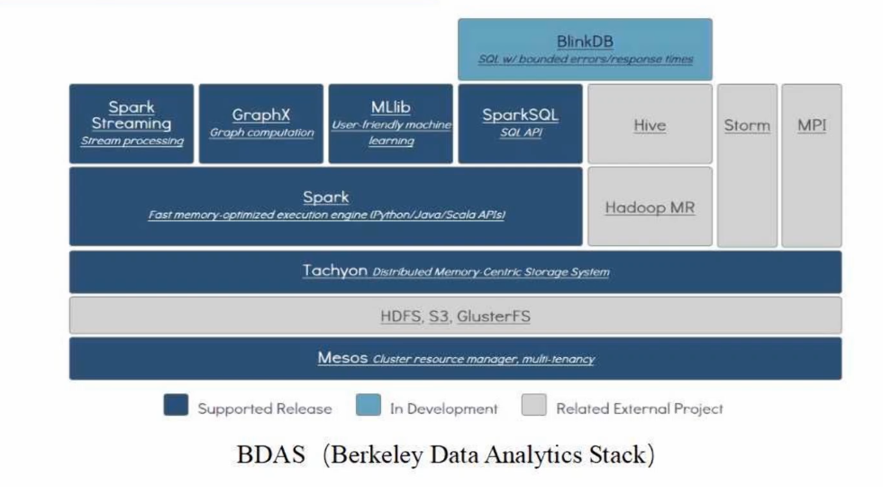
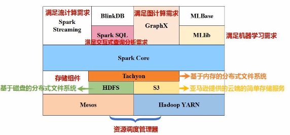
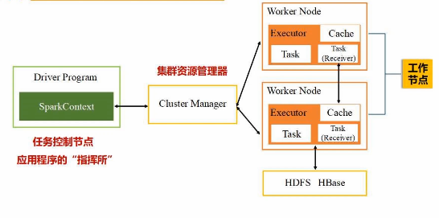
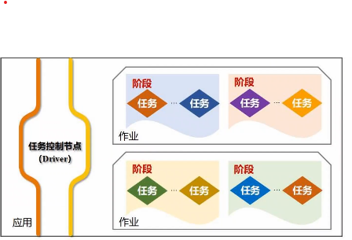
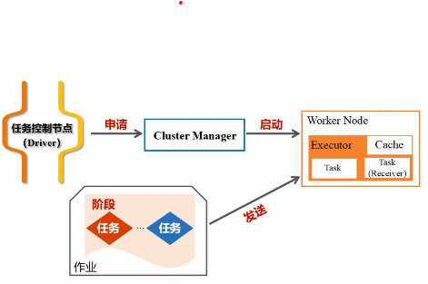
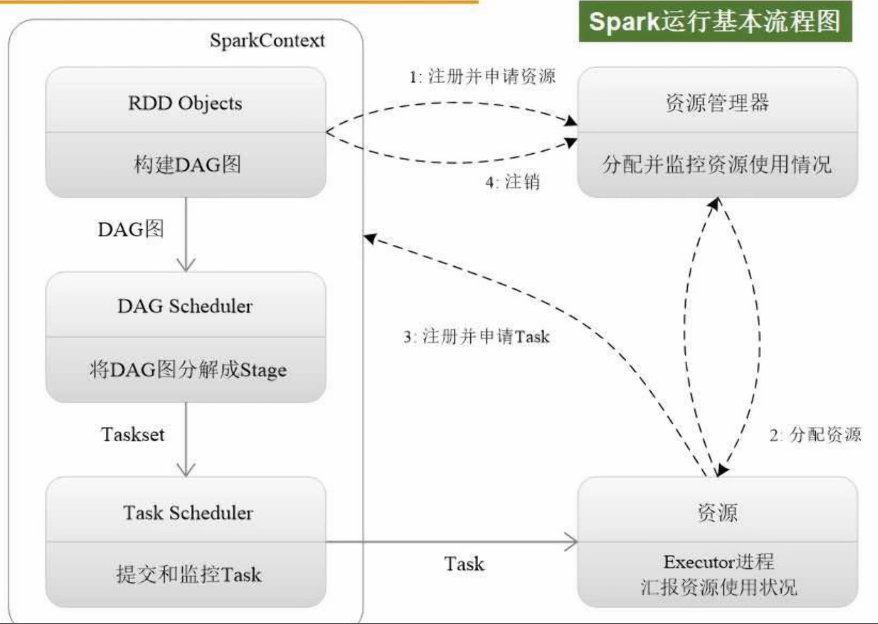

# spark设计运算原理
## 1. spark 概述
### 特点
运算速度快：
    1. 内存
        2. DAG 有向无环图

## 2. spark生态系统

tips:   
BDAS berkeley data analytics stack

## 3.spark 基本概念和架构设计

### 3.1 基本概念

RDD： 弹性分布式数据集；分布式内存的一个抽象概念，提供了高度受限的共享内存模型

DAG:有向无环图，反映 RDD之间的依赖关系

excutor：运行于每个工作节点的一个进程，负责task

application：用户编写的应用程序

task： 运行于executor上的工作单元

job： 一个job包含多个rdd及作用于相应RDD上的各种操作

stage： job的基本调度单位，一个job会分为多组task ，每组task被称为stage或taskset，代表一组关联的，相互之间没有shuffle依赖关系的任务组成的任务集

执行流程

### 3.2 spark 运行基本流程

### 3.3 RDD运行原理

